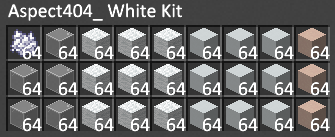

<div align="center">
<h1>Aspect401_ Kitbot Documentation</h1>
</div>

> ## Join my [Discord](https://discord.gg/24NrjJZm4A) to vote in polls, use commands, get notified of updates, and more!

# FAQ
### Where is the source code?
> - Unfortunately, the project is not open source at the moment. I would not like people to steal the source to gain credit for the development. I *might* release source if I find more people willing to contribute to help this project grow, fix bugs, and assist pay for the backend infrastructure to host the services.

### The bot didn't drop a kit, or it dropped multiple kits, is this a bug?
> - The bot must walk to chests and withdraw the kits, then ensures it has the kit in inventory before sending the tp request, however if someone else requested a kit at the same time, it would deliver both kits to the person who accepted the teleport first, and the next will be delivered without kits if the player doesn't request a new one. But of course you can always request for another kit if it doesn't deliver. Dropping multiple kits occurs when the bot withdraws kits and the person doesn't accept the tp request.

### How is the bot's ping so low?
> - I found a funny exploit in keepalive packet keys, the bot sends the packets 10ms early, often making the bot show as 3-8ms. The reason I don't have it even faster is due to variations of ping the bot could and does have, if the bot sends the packet too early it will cause a connection timeout.

### It says the bot is currently out of kits, what should I do?
> - Only the kit requested has been drained, and it will notify me in discord to fill it soon, you may of course request other kits until it is filled.

### It says I have been denied access to the service, how would I request an appeal?
> - The blacklist is only temporary, as the bot counts how many requests made and analyzes usage to determine whether or not it is being abused. This is in place to prevent users from basically "relocating my stash to their base". There is a `?dupe` command, which links a [video tutorial](https://youtu.be/TdoypGpkcz0) of how to perform a chunk dupe, as well as `?kit dupe` will give you all you need to perform the dupe.

### Is it a coordinate logger?
> - No, it is not, the data collected and/or broadcasted is listed below under Privacy Policy.

### How would I add the bot to my own discord server and setup a bridge?
> - You could join the [Official Server](https://discord.gg/24NrjJZm4A) and click on the bot's about me, it will have a button saying "Add to Server", by pressing it would open the default authorization (OAuth2) [link](https://ptb.discord.com/api/oauth2/authorize?client_id=1024403286968762368&permissions=1566254169297&scope=bot%20applications.commands). The bot uses slash commands, so by typing `/bridge` it will open the menu to setup the bridge channel. (**NOTE**: Invite has all perms needed to use the bot and bridge; but channel overrides are a pain, be sure to check it at least has perms for the bridge channel to make webhooks, edit the channel topic, etc. If missing permissions, it will reply with the permissions needed to setup.)

### What did you use to program the bot?
> - I started out with the [Mineflayer](https://github.com/PrismarineJS/mineflayer) library, but have recently migrated to using the plain [Minecraft-Protocol](https://github.com/PrismarineJS/node-minecraft-protocol) library so I can tweak with the packets more directly, allowing more features. Additional Credits: [Colors](https://github.com/Marak/colors.js) for clearer console logging. [Discord.js](https://github.com/discordjs/discord.js) for Discord integration. [Future AntiVanish Module](https://www.futureclient.net/) class dump from the [Gopro Archive](https://github.com/The-Gopro336-Archive/FutureDeobf/tree/master/net/futureclient/client/modules/miscellaneous/antivanish) for revealing hidden players. [Linode Cloud](https://www.linode.com/) (I previously used [Contabo](https://contabo.com/)) for hosting service. [MC-Heads API](https://mc-heads.net/) for player heads in bridges. [Mojang API](https://api.mojang.com/users/profiles/minecraft/Aspect404_) for fetching UUIDs of players. [MongoDB Atlas](https://www.mongodb.com/atlas/database) for databases. [Mongoose](https://github.com/Automattic/mongoose) for MongoDB object modeling. [Node-Fetch](https://github.com/node-fetch/node-fetch) for HTTP requests to APIs and Discord webhooks. [Pratax](https://github.com/Prataxx/) for the idea of creating this project. [Vec3](https://github.com/PrismarineJS/node-vec3) for relative locations of the kit chests. This project is not forked or skidded from another bot, this is original.

# Commands
Commands with arguments use [ ] for non-required arguments and < > for required arguments.
### In-Game Commands


> - `?afk [reason]` Sets yourself as afk in game, which will notify people that you are afk if they mention your username in chat, will automatically remove on next message or upon leaving the server.
> - `?bestping` or `?bp` Replies with which player online has best ping.
> - `?count [username]` Lists the total amount of kits delivered if no username given, otherwise will display the amount requested by the specified user.
> - `?coords` Give the coordinates of the bot.
> - `?copy` Copy everything the user says. (Developer Only)
> - `?dupe` Links [this video](https://youtu.be/TdoypGpkcz0) to provide a tutorial on how to perform chunk dupe.
> - `?health` Shows the health of the bot.
> - `?help` Help command, supplies with [Discord Server invite](https://discord.gg/24NrjJZm4A) for support and this documentation.
> - `?kick` Working kick exploits in other bots. (Developer Only)
> - `?kill` Kill the bot.
> - `?kit <name> [count]` Request a specific kit from the bot, check Selection of Kits below for the full list. **This is whitelist right now due to low stock and not being able to maintain if it was public.**
> - `?reddit <subreddit>` Fetch the last reddit post from the specified subreddit.
> - `?ping [username]` Shows your ping if no username given, otherwise will display the ping of the specified user.
> - `?seed` Gives 0b0t.org seed -4172144997902289642 for people who can't look it up.
> - `?tpdisable <username>` Teleport Exploit (Developer Only)
> - `?uptime` Displays the uptime of the bot.
> - `?urban <search>` Fetches the result from the [Urban Dictonary](https://urbandictionary.com/)
> - `?worstping` or `?wp` Replies with which player online has worst ping.

### Discord Commands
> - `/bot` Shows data regarding the bot, like ram usage and uptime.
> - `/dev` Developer Options. (Developer Only)
> - `/bridge <#channel>` Setup a channel to have a chat bridge, requires ADMINISTRATOR permissions on the server.
> - `/server` Replies with information about 0b0t.org, such as players, their ping, TPS, and more!

# Selection of Kits
<details>
<summary>Standard Kit</summary>

> Use `?kit standard [count]`


NBT Data:
```json
{BlockEntityTag:{CustomName:"§fAspect404_ Standard Kit§r",x:0,y:0,z:0,Items:[{Slot:0b,id:"minecraft:diamond_helmet",tag:{ench:[{lvl:4s,id:0s},{lvl:3s,id:5s},{lvl:1s,id:6s},{lvl:3s,id:34s},{lvl:1s,id:70s},{lvl:1s,id:71s}],RepairCost:3},Count:1b,Damage:0s},{Slot:1b,id:"minecraft:diamond_chestplate",tag:{ench:[{lvl:4s,id:0s},{lvl:3s,id:34s},{lvl:1s,id:70s},{lvl:1s,id:71s}],RepairCost:7},Count:1b,Damage:0s},{Slot:2b,id:"minecraft:diamond_leggings",tag:{ench:[{lvl:4s,id:3s},{lvl:3s,id:34s},{lvl:1s,id:70s},{lvl:1s,id:71s}],RepairCost:7},Count:1b,Damage:0s},{Slot:3b,id:"minecraft:diamond_boots",tag:{ench:[{lvl:4s,id:0s},{lvl:4s,id:2s},{lvl:2s,id:9s},{lvl:3s,id:34s},{lvl:1s,id:70s},{lvl:1s,id:71s}],RepairCost:3},Count:1b,Damage:0s},{Slot:4b,id:"minecraft:golden_apple",Count:64b,Damage:1s},{Slot:5b,id:"minecraft:golden_apple",Count:64b,Damage:1s},{Slot:6b,id:"minecraft:totem_of_undying",Count:1b,Damage:0s},{Slot:7b,id:"minecraft:experience_bottle",Count:64b,Damage:0s},{Slot:8b,id:"minecraft:obsidian",Count:64b,Damage:0s},{Slot:9b,id:"minecraft:diamond_sword",tag:{ench:[{lvl:5s,id:16s},{lvl:2s,id:19s},{lvl:2s,id:20s},{lvl:3s,id:21s},{lvl:3s,id:22s},{lvl:3s,id:34s},{lvl:1s,id:70s},{lvl:1s,id:71s}],RepairCost:3},Count:1b,Damage:0s},{Slot:10b,id:"minecraft:diamond_pickaxe",tag:{ench:[{lvl:5s,id:32s},{lvl:1s,id:33s},{lvl:3s,id:34s},{lvl:1s,id:70s}],RepairCost:15},Count:1b,Damage:0s},{Slot:11b,id:"minecraft:diamond_pickaxe",tag:{ench:[{lvl:5s,id:32s},{lvl:3s,id:34s},{lvl:3s,id:35s},{lvl:1s,id:70s}],RepairCost:3},Count:1b,Damage:0s},{Slot:12b,id:"minecraft:diamond_axe",tag:{ench:[{lvl:5s,id:32s},{lvl:1s,id:33s},{lvl:3s,id:34s},{lvl:1s,id:70s}],RepairCost:15},Count:1b,Damage:0s},{Slot:13b,id:"minecraft:diamond_shovel",tag:{ench:[{lvl:4s,id:32s},{lvl:1s,id:33s},{lvl:3s,id:34s},{lvl:1s,id:70s}],RepairCost:7},Count:1b,Damage:0s},{Slot:14b,id:"minecraft:flint_and_steel",tag:{ench:[{lvl:3s,id:34s},{lvl:1s,id:70s},{lvl:1s,id:71s}],RepairCost:7},Count:1b,Damage:0s},{Slot:15b,id:"minecraft:totem_of_undying",Count:1b,Damage:0s},{Slot:16b,id:"minecraft:experience_bottle",Count:64b,Damage:0s},{Slot:17b,id:"minecraft:end_crystal",Count:64b,Damage:0s},{Slot:18b,id:"minecraft:elytra",tag:{ench:[{lvl:3s,id:34s},{lvl:1s,id:70s},{lvl:1s,id:71s}],RepairCost:15},Count:1b,Damage:0s},{Slot:19b,id:"minecraft:fireworks",tag:{Fireworks:{Flight:3b}},Count:64b,Damage:0s},{Slot:20b,id:"minecraft:ender_pearl",Count:16b,Damage:0s},{Slot:21b,id:"minecraft:chorus_fruit",Count:64b,Damage:0s},{Slot:22b,id:"minecraft:bow",tag:{ench:[{lvl:3s,id:34s},{lvl:5s,id:48s},{lvl:2s,id:49s},{lvl:1s,id:50s},{lvl:1s,id:51s},{lvl:1s,id:71s}],RepairCost:15},Count:1b,Damage:0s},{Slot:23b,id:"minecraft:tipped_arrow",tag:{Potion:"minecraft:strong_harming"},Count:64b,Damage:0s},{Slot:24b,id:"minecraft:totem_of_undying",Count:1b,Damage:0s},{Slot:25b,id:"minecraft:experience_bottle",Count:64b,Damage:0s},{Slot:26b,id:"minecraft:ender_chest",Count:64b,Damage:0s}],id:"minecraft:shulker_box",Lock:""},display:{Name:"§fAspect404_ Standard Kit§r"}}
```
<br>
</details>
<details>
<summary>Pvp Kit</summary>

> Use `?kit pvp [count]`


NBT Data:
```json
{BlockEntityTag:{CustomName:"§fAspect404_ PvP Kit§r",x:0,y:0,z:0,Items:[{Slot:0b,id:"minecraft:diamond_helmet",tag:{ench:[{lvl:4s,id:0s},{lvl:3s,id:5s},{lvl:1s,id:6s},{lvl:3s,id:34s},{lvl:1s,id:70s},{lvl:1s,id:71s}],RepairCost:3},Count:1b,Damage:0s},{Slot:1b,id:"minecraft:diamond_chestplate",tag:{ench:[{lvl:4s,id:0s},{lvl:3s,id:34s},{lvl:1s,id:70s},{lvl:1s,id:71s}],RepairCost:7},Count:1b,Damage:0s},{Slot:2b,id:"minecraft:diamond_leggings",tag:{ench:[{lvl:4s,id:3s},{lvl:3s,id:34s},{lvl:1s,id:70s},{lvl:1s,id:71s}],RepairCost:7},Count:1b,Damage:0s},{Slot:3b,id:"minecraft:diamond_boots",tag:{ench:[{lvl:4s,id:0s},{lvl:4s,id:2s},{lvl:2s,id:9s},{lvl:3s,id:34s},{lvl:1s,id:70s},{lvl:1s,id:71s}],RepairCost:3},Count:1b,Damage:0s},{Slot:4b,id:"minecraft:anvil",Count:64b,Damage:0s},{Slot:5b,id:"minecraft:golden_apple",Count:64b,Damage:1s},{Slot:6b,id:"minecraft:totem_of_undying",Count:1b,Damage:0s},{Slot:7b,id:"minecraft:totem_of_undying",Count:1b,Damage:0s},{Slot:8b,id:"minecraft:end_crystal",Count:64b,Damage:0s},{Slot:9b,id:"minecraft:diamond_sword",tag:{ench:[{lvl:5s,id:16s},{lvl:2s,id:19s},{lvl:2s,id:20s},{lvl:3s,id:21s},{lvl:3s,id:22s},{lvl:3s,id:34s},{lvl:1s,id:70s},{lvl:1s,id:71s}],RepairCost:3},Count:1b,Damage:0s},{Slot:10b,id:"minecraft:diamond_pickaxe",tag:{ench:[{lvl:5s,id:32s},{lvl:3s,id:34s},{lvl:3s,id:35s},{lvl:1s,id:70s}],RepairCost:3},Count:1b,Damage:0s},{Slot:11b,id:"minecraft:bow",tag:{ench:[{lvl:3s,id:34s},{lvl:5s,id:48s},{lvl:2s,id:49s},{lvl:1s,id:50s},{lvl:1s,id:51s},{lvl:1s,id:71s}],RepairCost:15},Count:1b,Damage:0s},{Slot:12b,id:"minecraft:tipped_arrow",tag:{Potion:"minecraft:long_weakness"},Count:64b,Damage:0s},{Slot:13b,id:"minecraft:tipped_arrow",tag:{Potion:"minecraft:strong_harming"},Count:64b,Damage:0s},{Slot:14b,id:"minecraft:ender_pearl",Count:16b,Damage:0s},{Slot:15b,id:"minecraft:totem_of_undying",Count:1b,Damage:0s},{Slot:16b,id:"minecraft:ender_chest",Count:64b,Damage:0s},{Slot:17b,id:"minecraft:end_crystal",Count:64b,Damage:0s},{Slot:18b,id:"minecraft:experience_bottle",Count:64b,Damage:0s},{Slot:19b,id:"minecraft:experience_bottle",Count:64b,Damage:0s},{Slot:20b,id:"minecraft:experience_bottle",Count:64b,Damage:0s},{Slot:21b,id:"minecraft:experience_bottle",Count:64b,Damage:0s},{Slot:22b,id:"minecraft:potion",tag:{Potion:"minecraft:strong_strength"},Count:1b,Damage:0s},{Slot:23b,id:"minecraft:chorus_fruit",Count:64b,Damage:0s},{Slot:24b,id:"minecraft:totem_of_undying",Count:1b,Damage:0s},{Slot:25b,id:"minecraft:end_crystal",Count:64b,Damage:0s},{Slot:26b,id:"minecraft:end_crystal",Count:64b,Damage:0s}],id:"minecraft:shulker_box",Lock:""},display:{Name:"§fAspect404_ PvP Kit§r"}}
```
<br>
</details>
<details>
<summary>Regear Kit</summary>

> Use `?kit regear [count]`


NBT Data:
```json
{BlockEntityTag:{CustomName:"§fAspect404_ Regear Kit§r",x:0,y:0,z:0,Items:[{Slot:0b,id:"minecraft:diamond_helmet",tag:{ench:[{lvl:4s,id:0s},{lvl:3s,id:5s},{lvl:1s,id:6s},{lvl:3s,id:34s},{lvl:1s,id:70s},{lvl:1s,id:71s}],RepairCost:3},Count:1b,Damage:0s},{Slot:1b,id:"minecraft:diamond_chestplate",tag:{ench:[{lvl:4s,id:0s},{lvl:3s,id:34s},{lvl:1s,id:70s},{lvl:1s,id:71s}],RepairCost:7},Count:1b,Damage:0s},{Slot:2b,id:"minecraft:experience_bottle",Count:64b,Damage:0s},{Slot:3b,id:"minecraft:golden_apple",Count:64b,Damage:1s},{Slot:4b,id:"minecraft:totem_of_undying",Count:1b,Damage:0s},{Slot:5b,id:"minecraft:obsidian",Count:64b,Damage:0s},{Slot:6b,id:"minecraft:end_crystal",Count:64b,Damage:0s},{Slot:7b,id:"minecraft:end_crystal",Count:64b,Damage:0s},{Slot:8b,id:"minecraft:end_crystal",Count:64b,Damage:0s},{Slot:9b,id:"minecraft:diamond_leggings",tag:{ench:[{lvl:4s,id:3s},{lvl:3s,id:34s},{lvl:1s,id:70s},{lvl:1s,id:71s}],RepairCost:7},Count:1b,Damage:0s},{Slot:10b,id:"minecraft:diamond_boots",tag:{ench:[{lvl:4s,id:0s},{lvl:4s,id:2s},{lvl:2s,id:9s},{lvl:3s,id:34s},{lvl:1s,id:70s},{lvl:1s,id:71s}],RepairCost:3},Count:1b,Damage:0s},{Slot:11b,id:"minecraft:experience_bottle",Count:64b,Damage:0s},{Slot:12b,id:"minecraft:totem_of_undying",Count:1b,Damage:0s},{Slot:13b,id:"minecraft:totem_of_undying",Count:1b,Damage:0s},{Slot:14b,id:"minecraft:obsidian",Count:64b,Damage:0s},{Slot:15b,id:"minecraft:end_crystal",Count:64b,Damage:0s},{Slot:16b,id:"minecraft:end_crystal",Count:64b,Damage:0s},{Slot:17b,id:"minecraft:end_crystal",Count:64b,Damage:0s},{Slot:18b,id:"minecraft:experience_bottle",Count:64b,Damage:0s},{Slot:19b,id:"minecraft:experience_bottle",Count:64b,Damage:0s},{Slot:20b,id:"minecraft:experience_bottle",Count:64b,Damage:0s},{Slot:21b,id:"minecraft:totem_of_undying",Count:1b,Damage:0s},{Slot:22b,id:"minecraft:totem_of_undying",Count:1b,Damage:0s},{Slot:23b,id:"minecraft:ender_chest",Count:64b,Damage:0s},{Slot:24b,id:"minecraft:end_crystal",Count:64b,Damage:0s},{Slot:25b,id:"minecraft:end_crystal",Count:64b,Damage:0s},{Slot:26b,id:"minecraft:end_crystal",Count:64b,Damage:0s}],id:"minecraft:shulker_box",Lock:""},display:{Name:"§fAspect404_ Regear Kit§r"}}
```
<br>
</details>
<details>
<summary>Kepterv Kit</summary>

> Use `?kit kepterv [count]`


NBT Data:
```json
{BlockEntityTag:{x:0,y:0,Items:[{Slot:0b,id:"minecraft:experience_bottle",Count:64b,Damage:0s},{Slot:1b,id:"minecraft:obsidian",Count:64b,Damage:0s},{Slot:2b,id:"minecraft:totem_of_undying",tag:{display:{Name:"Kepterv saves lifes"}},Count:1b,Damage:0s},{Slot:3b,id:"minecraft:totem_of_undying",tag:{display:{Name:"Kepterv saves lifes"}},Count:1b,Damage:0s},{Slot:4b,id:"minecraft:totem_of_undying",tag:{display:{Name:"Kepterv saves lifes"}},Count:1b,Damage:0s},{Slot:5b,id:"minecraft:diamond_boots",tag:{ench:[{lvl:4s,id:0s},{lvl:4s,id:2s},{lvl:2s,id:9s},{lvl:3s,id:34s},{lvl:1s,id:70s},{lvl:1s,id:71s}],RepairCost:3,display:{Name:"Keptervs yeezys"}},Count:1b,Damage:0s},{Slot:6b,id:"minecraft:diamond_leggings",tag:{ench:[{lvl:4s,id:3s},{lvl:3s,id:34s},{lvl:1s,id:70s},{lvl:1s,id:71s}],RepairCost:7,display:{Name:"femboy leggins"}},Count:1b,Damage:0s},{Slot:7b,id:"minecraft:diamond_chestplate",tag:{ench:[{lvl:4s,id:0s},{lvl:3s,id:34s},{lvl:1s,id:70s},{lvl:1s,id:71s}],RepairCost:7,display:{Name:"Manslut shirt"}},Count:1b,Damage:0s},{Slot:8b,id:"minecraft:diamond_helmet",tag:{ench:[{lvl:4s,id:0s},{lvl:3s,id:5s},{lvl:1s,id:6s},{lvl:3s,id:34s},{lvl:1s,id:70s},{lvl:1s,id:71s}],RepairCost:3,display:{Name:"Construction helmet"}},Count:1b,Damage:0s},{Slot:9b,id:"minecraft:end_crystal",Count:64b,Damage:0s},{Slot:10b,id:"minecraft:end_crystal",Count:64b,Damage:0s},{Slot:11b,id:"minecraft:obsidian",Count:64b,Damage:0s},{Slot:12b,id:"minecraft:potion",tag:{Potion:"minecraft:strong_strength",display:{Name:"§c§l<3 Kit by Kepterv <3§r"}},Count:1b,Damage:0s},{Slot:13b,id:"minecraft:totem_of_undying",tag:{display:{Name:"Kepterv saves lifes"}},Count:1b,Damage:0s},{Slot:14b,id:"minecraft:totem_of_undying",tag:{display:{Name:"Kepterv saves lifes"}},Count:1b,Damage:0s},{Slot:15b,id:"minecraft:totem_of_undying",tag:{display:{Name:"Kepterv saves lifes"}},Count:1b,Damage:0s},{Slot:16b,id:"minecraft:tipped_arrow",tag:{Potion:"minecraft:strong_harming",display:{Name:"Kepterv ouchies"}},Count:64b,Damage:0s},{Slot:17b,id:"minecraft:ender_chest",Count:64b,Damage:0s},{Slot:18b,id:"minecraft:bow",tag:{ench:[{lvl:3s,id:34s},{lvl:5s,id:48s},{lvl:2s,id:49s},{lvl:1s,id:50s},{lvl:1s,id:51s},{lvl:1s,id:71s}],RepairCost:15,display:{Name:"Keptervs cumthrower"}},Count:1b,Damage:0s},{Slot:19b,id:"minecraft:ender_pearl",tag:{display:{Name:"Keptervs balls"}},Count:16b,Damage:0s},{Slot:20b,id:"minecraft:chorus_fruit",tag:{display:{Name:"§f§lsecond chance to get out of box§r"}},Count:64b,Damage:0s},{Slot:21b,id:"minecraft:obsidian",Count:64b,Damage:0s},{Slot:22b,id:"minecraft:experience_bottle",Count:64b,Damage:0s},{Slot:23b,id:"minecraft:end_crystal",Count:64b,Damage:0s},{Slot:24b,id:"minecraft:golden_apple",tag:{display:{Name:"§5§lKeptervs health giver§r"}},Count:64b,Damage:1s},{Slot:25b,id:"minecraft:diamond_pickaxe",tag:{ench:[{lvl:5s,id:32s},{lvl:3s,id:34s},{lvl:3s,id:35s},{lvl:1s,id:70s}],RepairCost:3,display:{Name:"§b§lKepterv fastus pickus§r"}},Count:1b,Damage:0s},{Slot:26b,id:"minecraft:diamond_sword",tag:{ench:[{lvl:5s,id:16s},{lvl:2s,id:19s},{lvl:2s,id:20s},{lvl:3s,id:21s},{lvl:3s,id:22s},{lvl:3s,id:34s},{lvl:1s,id:70s},{lvl:1s,id:71s}],RepairCost:1,display:{Name:"§b§lKeptervlibor§r"}},Count:1b,Damage:0s}],z:0,id:"minecraft:shulker_box",Lock:""},display:{Name:"§c§lKeptervs pvp kit?§r"}}
```
<br>
</details>
<details>
<summary>Elle Kit</summary>

> Use `?kit elle [count]`


NBT Data:
```json
{BlockEntityTag:{CustomName:"Elle's PvP Kit",x:0,y:0,z:0,Items:[{Slot:0b,id:"minecraft:diamond_helmet",tag:{ench:[{lvl:4s,id:0s},{lvl:3s,id:5s},{lvl:1s,id:6s},{lvl:3s,id:34s},{lvl:1s,id:70s},{lvl:1s,id:71s}],RepairCost:3,display:{Name:"Elle's Helmet"}},Count:1b,Damage:0s},{Slot:1b,id:"minecraft:diamond_chestplate",tag:{ench:[{lvl:4s,id:0s},{lvl:3s,id:34s},{lvl:1s,id:70s},{lvl:1s,id:71s}],RepairCost:7,display:{Name:"Elle's Chestplate"}},Count:1b,Damage:0s},{Slot:2b,id:"minecraft:diamond_leggings",tag:{ench:[{lvl:4s,id:3s},{lvl:3s,id:34s},{lvl:1s,id:70s},{lvl:1s,id:71s}],RepairCost:7,display:{Name:"Elle's Leggings"}},Count:1b,Damage:0s},{Slot:3b,id:"minecraft:diamond_boots",tag:{ench:[{lvl:4s,id:0s},{lvl:4s,id:2s},{lvl:3s,id:8s},{lvl:3s,id:34s},{lvl:1s,id:70s},{lvl:1s,id:71s}],RepairCost:63,display:{Name:"Elle's Boots"}},Count:1b,Damage:0s},{Slot:4b,id:"minecraft:experience_bottle",Count:64b,Damage:0s},{Slot:5b,id:"minecraft:obsidian",Count:64b,Damage:0s},{Slot:6b,id:"minecraft:totem_of_undying",tag:{display:{Name:"Elle's Lifesaver"}},Count:1b,Damage:0s},{Slot:7b,id:"minecraft:totem_of_undying",tag:{display:{Name:"Elle's Lifesaver"}},Count:1b,Damage:0s},{Slot:8b,id:"minecraft:tipped_arrow",tag:{Potion:"minecraft:strong_harming"},Count:64b,Damage:0s},{Slot:9b,id:"minecraft:ender_chest",Count:64b,Damage:0s},{Slot:10b,id:"minecraft:golden_apple",Count:64b,Damage:1s},{Slot:11b,id:"minecraft:experience_bottle",Count:64b,Damage:0s},{Slot:12b,id:"minecraft:experience_bottle",Count:64b,Damage:0s},{Slot:13b,id:"minecraft:experience_bottle",Count:64b,Damage:0s},{Slot:14b,id:"minecraft:end_crystal",Count:64b,Damage:0s},{Slot:15b,id:"minecraft:chorus_fruit",Count:64b,Damage:0s},{Slot:16b,id:"minecraft:totem_of_undying",tag:{display:{Name:"Elle's Lifesaver"}},Count:1b,Damage:0s},{Slot:17b,id:"minecraft:totem_of_undying",tag:{display:{Name:"Elle's Lifesaver"}},Count:1b,Damage:0s},{Slot:18b,id:"minecraft:diamond_sword",tag:{ench:[{lvl:5s,id:16s},{lvl:2s,id:19s},{lvl:2s,id:20s},{lvl:3s,id:21s},{lvl:3s,id:22s},{lvl:3s,id:34s},{lvl:1s,id:70s},{lvl:1s,id:71s}],RepairCost:31,display:{Name:"Elle's Beheader"}},Count:1b,Damage:0s},{Slot:19b,id:"minecraft:golden_apple",Count:64b,Damage:1s},{Slot:20b,id:"minecraft:diamond_pickaxe",tag:{ench:[{lvl:5s,id:32s},{lvl:1s,id:71s}],RepairCost:63,HideFlags:59,display:{Lore:["§4DIGGG THE HIGHWAY"],Name:"Elle's Surround Stopper"}},Count:1b,Damage:0s},{Slot:21b,id:"minecraft:bow",tag:{ench:[{lvl:3s,id:34s},{lvl:5s,id:48s},{lvl:2s,id:49s},{lvl:1s,id:50s},{lvl:1s,id:70s},{lvl:1s,id:71s}],RepairCost:15,display:{Name:"Elle's Shooter"}},Count:1b,Damage:0s},{Slot:22b,id:"minecraft:end_crystal",Count:64b,Damage:0s},{Slot:23b,id:"minecraft:end_crystal",Count:64b,Damage:0s},{Slot:24b,id:"minecraft:ender_pearl",Count:16b,Damage:0s},{Slot:25b,id:"minecraft:totem_of_undying",tag:{display:{Name:"Elle's Lifesaver"}},Count:1b,Damage:0s},{Slot:26b,id:"minecraft:totem_of_undying",tag:{display:{Name:"Elle's Lifesaver"}},Count:1b,Damage:0s}],id:"minecraft:shulker_box",Lock:""},display:{Name:"§fElle's PvP Kit§r"}}
```
<br>
</details>
<details>
<summary>Gentle Kit</summary>

> Use `?kit gentle [count]`


NBT Data:
```json
{BlockEntityTag:{CustomName:"Gentleman's pvp kit",x:0,y:0,z:0,Items:[{Slot:0b,id:"minecraft:diamond_helmet",tag:{ench:[{lvl:4s,id:0s},{lvl:3s,id:5s},{lvl:1s,id:6s},{lvl:3s,id:34s},{lvl:1s,id:70s},{lvl:1s,id:71s}],RepairCost:3,display:{Name:"cool cap"}},Count:1b,Damage:0s},{Slot:1b,id:"minecraft:diamond_chestplate",tag:{ench:[{lvl:4s,id:0s},{lvl:3s,id:34s},{lvl:1s,id:70s},{lvl:1s,id:71s}],RepairCost:7,display:{Name:"nice t-shirt"}},Count:1b,Damage:0s},{Slot:2b,id:"minecraft:diamond_leggings",tag:{ench:[{lvl:4s,id:3s},{lvl:3s,id:34s},{lvl:1s,id:70s},{lvl:1s,id:71s}],RepairCost:7,display:{Name:"ugly shorts"}},Count:1b,Damage:0s},{Slot:3b,id:"minecraft:diamond_boots",tag:{ench:[{lvl:4s,id:0s},{lvl:4s,id:2s},{lvl:3s,id:8s},{lvl:3s,id:34s},{lvl:1s,id:70s},{lvl:1s,id:71s}],RepairCost:3,display:{Name:"jews"}},Count:1b,Damage:0s},{Slot:4b,id:"minecraft:experience_bottle",tag:{display:{Name:"A bottle of jew souls"}},Count:64b,Damage:0s},{Slot:5b,id:"minecraft:totem_of_undying",tag:{display:{Name:"no jahannam"}},Count:1b,Damage:0s},{Slot:6b,id:"minecraft:totem_of_undying",tag:{display:{Name:"no jahannam"}},Count:1b,Damage:0s},{Slot:7b,id:"minecraft:end_crystal",tag:{display:{Name:"Gentleman's jew bomber"}},Count:64b,Damage:0s},{Slot:8b,id:"minecraft:end_crystal",tag:{display:{Name:"Gentleman's jew bomber"}},Count:64b,Damage:0s},{Slot:9b,id:"minecraft:obsidian",Count:64b,Damage:0s},{Slot:10b,id:"minecraft:obsidian",Count:64b,Damage:0s},{Slot:11b,id:"minecraft:golden_apple",tag:{display:{Name:"Kabsa"}},Count:64b,Damage:1s},{Slot:12b,id:"minecraft:chorus_fruit",tag:{display:{Name:"✯Get out✯"}},Count:64b,Damage:0s},{Slot:13b,id:"minecraft:experience_bottle",tag:{display:{Name:"A bottle of jew souls"}},Count:64b,Damage:0s},{Slot:14b,id:"minecraft:totem_of_undying",tag:{display:{Name:"no jahannam"}},Count:1b,Damage:0s},{Slot:15b,id:"minecraft:totem_of_undying",tag:{display:{Name:"no jahannam"}},Count:1b,Damage:0s},{Slot:16b,id:"minecraft:end_crystal",tag:{display:{Name:"Gentleman's jew bomber"}},Count:64b,Damage:0s},{Slot:17b,id:"minecraft:end_crystal",tag:{display:{Name:"Gentleman's jew bomber"}},Count:64b,Damage:0s},{Slot:18b,id:"minecraft:diamond_sword",tag:{ench:[{lvl:5s,id:16s},{lvl:2s,id:19s},{lvl:2s,id:20s},{lvl:3s,id:21s},{lvl:3s,id:22s},{lvl:3s,id:34s},{lvl:1s,id:70s},{lvl:1s,id:71s}],RepairCost:1,display:{Name:"✯jew cutter✯"}},Count:1b,Damage:0s},{Slot:19b,id:"minecraft:diamond_pickaxe",tag:{ench:[{lvl:5s,id:32s},{lvl:3s,id:34s},{lvl:3s,id:35s},{lvl:1s,id:70s}],RepairCost:3,display:{Name:"Grave digger"}},Count:1b,Damage:0s},{Slot:20b,id:"minecraft:golden_apple",tag:{display:{Name:"Kabsa"}},Count:64b,Damage:1s},{Slot:21b,id:"minecraft:ender_pearl",tag:{display:{Name:"Portal 2"}},Count:16b,Damage:0s},{Slot:22b,id:"minecraft:experience_bottle",tag:{display:{Name:"A bottle of jew souls"}},Count:64b,Damage:0s},{Slot:23b,id:"minecraft:totem_of_undying",tag:{display:{Name:"no jahannam"}},Count:1b,Damage:0s},{Slot:24b,id:"minecraft:totem_of_undying",tag:{display:{Name:"no jahannam"}},Count:1b,Damage:0s},{Slot:25b,id:"minecraft:end_crystal",tag:{display:{Name:"Gentleman's jew bomber"}},Count:64b,Damage:0s},{Slot:26b,id:"minecraft:end_crystal",tag:{display:{Name:"Gentleman's jew bomber"}},Count:64b,Damage:0s}],id:"minecraft:shulker_box",Lock:""},display:{Name:"§fGentleman's pvp kit§r"}}
```
<br>
</details>
<details>
<summary>Para Kit</summary>

> Use `?kit para [count]`


NBT Data:
```json
{BlockEntityTag:{CustomName:"ᴘᴀʀᴀɴᴏᴍᴀʟꜱʜʀɪᴍᴘ'ꜱ ʙᴀʟʟᴇʀ ʙᴏx <3",x:0,y:0,z:0,Items:[{Slot:0b,id:"minecraft:filled_map",tag:{display:{Name:"W ahh flag"}},Count:64b,Damage:27743s},{Slot:1b,id:"minecraft:totem_of_undying",tag:{display:{Name:"gå¥ mðñkê¥"}},Count:1b,Damage:0s},{Slot:2b,id:"minecraft:totem_of_undying",tag:{display:{Name:"gay monkey"}},Count:1b,Damage:0s},{Slot:3b,id:"minecraft:totem_of_undying",tag:{display:{Name:"【g】【a】【y】 【m】【o】【n】【k】【e】【y】"}},Count:1b,Damage:0s},{Slot:4b,id:"minecraft:diamond_boots",tag:{ench:[{lvl:4s,id:0s},{lvl:4s,id:2s},{lvl:2s,id:9s},{lvl:3s,id:34s},{lvl:1s,id:70s},{lvl:1s,id:71s}],RepairCost:3,display:{Name:"ᴘᴀʀᴀɴᴏᴍᴀʟ ꜱʜʀɪᴍᴘ ᴛᴏᴇ ɢʀᴏᴘᴇʀꜱ"}},Count:1b,Damage:0s},{Slot:5b,id:"minecraft:diamond_leggings",tag:{ench:[{lvl:4s,id:3s},{lvl:3s,id:34s},{lvl:1s,id:70s},{lvl:1s,id:71s}],RepairCost:7,display:{Name:"ᴘᴀʀᴀɴᴏᴍᴀʟ ꜱʜʀɪᴍᴘ'ꜱ ꜱᴋɪʀᴛ"}},Count:1b,Damage:0s},{Slot:6b,id:"minecraft:experience_bottle",tag:{display:{Name:"ᴘᴀʀᴀɴᴏᴍᴀʟ ꜱʜʀɪᴍᴘ'ꜱ ᴡᴏᴋ"}},Count:64b,Damage:0s},{Slot:7b,id:"minecraft:experience_bottle",tag:{display:{Name:"ᴘᴀʀᴀɴᴏᴍᴀʟ ꜱʜʀɪᴍᴘ'ꜱ ᴡᴏᴋ"}},Count:64b,Damage:0s},{Slot:8b,id:"minecraft:elytra",tag:{ench:[{lvl:3s,id:34s},{lvl:1s,id:70s},{lvl:1s,id:71s}],RepairCost:15,display:{Name:"ᴘᴀʀᴀɴᴏᴍᴀʟ ꜱʜʀɪᴍᴘ'ꜱ ʙɪʀᴅ ᴄᴏꜱᴘʟᴀʏ"}},Count:1b,Damage:0s},{Slot:9b,id:"minecraft:totem_of_undying",tag:{display:{Name:"ʎǝʞuoɯ ʎɐɓ"}},Count:1b,Damage:0s},{Slot:10b,id:"minecraft:totem_of_undying",tag:{display:{Name:"ɢᴀʏ ᴍᴏɴᴋᴇʏ"}},Count:1b,Damage:0s},{Slot:11b,id:"minecraft:totem_of_undying",tag:{display:{Name:"Ꮆ卂ㄚ 爪ㄖ几Ҝ乇ㄚ"}},Count:1b,Damage:0s},{Slot:12b,id:"minecraft:totem_of_undying",tag:{display:{Name:"░g░a░y░ ░m░o░n░k░e░y░"}},Count:1b,Damage:0s},{Slot:13b,id:"minecraft:diamond_helmet",tag:{ench:[{lvl:4s,id:0s},{lvl:3s,id:5s},{lvl:1s,id:6s},{lvl:3s,id:34s},{lvl:1s,id:70s},{lvl:1s,id:71s}],RepairCost:3,display:{Name:"ᴘᴀʀᴀɴᴏᴍᴀʟ ꜱʜʀɪᴍᴘ ʜᴀᴛ"}},Count:1b,Damage:0s},{Slot:14b,id:"minecraft:diamond_chestplate",tag:{ench:[{lvl:4s,id:0s},{lvl:3s,id:34s},{lvl:1s,id:70s},{lvl:1s,id:71s}],RepairCost:7,display:{Name:"ᴘᴀʀᴀɴᴏᴍᴀʟ ꜱʜʀɪᴍᴘ ɴɪᴘᴘʟᴇ ᴄᴏɴᴄᴇᴀʟᴇʀꜱ"}},Count:1b,Damage:0s},{Slot:15b,id:"minecraft:diamond_pickaxe",tag:{ench:[{lvl:5s,id:32s},{lvl:1s,id:33s},{lvl:3s,id:34s},{lvl:1s,id:70s}],RepairCost:15,display:{Name:"freeross.org fire website"}},Count:1b,Damage:0s},{Slot:16b,id:"minecraft:diamond_axe",tag:{ench:[{lvl:5s,id:32s},{lvl:1s,id:33s},{lvl:3s,id:34s},{lvl:1s,id:70s}],RepairCost:15,display:{Name:"para's silly axe"}},Count:1b,Damage:0s},{Slot:17b,id:"minecraft:diamond_shovel",tag:{ench:[{lvl:5s,id:32s},{lvl:1s,id:33s},{lvl:3s,id:34s},{lvl:1s,id:70s}],RepairCost:15,display:{Name:"para's spoon"}},Count:1b,Damage:0s},{Slot:18b,id:"minecraft:diamond_sword",tag:{ench:[{lvl:5s,id:16s},{lvl:2s,id:19s},{lvl:2s,id:20s},{lvl:3s,id:21s},{lvl:3s,id:22s},{lvl:3s,id:34s},{lvl:1s,id:70s},{lvl:1s,id:71s}],RepairCost:31,display:{Name:"ᴘᴀʀᴀɴᴏᴍᴀʟ ꜱʜʀɪᴍᴘ'ꜱ ʙᴜᴛᴛᴇʀ ᴋɴɪꜰᴇ"}},Count:1b,Damage:0s},{Slot:19b,id:"minecraft:diamond_pickaxe",tag:{ench:[{lvl:5s,id:32s},{lvl:3s,id:34s},{lvl:3s,id:35s},{lvl:1s,id:70s}],RepairCost:3,display:{Name:"ᴘᴀʀᴀɴᴏᴍᴀʟ ꜱʜʀɪᴍᴘ'ꜱ ɴᴏꜱᴇ ᴘɪᴄᴋᴇʀ"}},Count:1b,Damage:0s},{Slot:20b,id:"minecraft:obsidian",Count:64b,Damage:0s},{Slot:21b,id:"minecraft:ender_chest",Count:64b,Damage:0s},{Slot:22b,id:"minecraft:flint_and_steel",tag:{ench:[{lvl:3s,id:34s},{lvl:1s,id:70s},{lvl:1s,id:71s}],RepairCost:7,display:{Name:"ᴘᴀʀᴀɴᴏᴍᴀʟ ꜱʜʀɪᴍᴘ'ꜱ ᴢɪᴘᴘᴏ"}},Count:1b,Damage:0s},{Slot:23b,id:"minecraft:end_crystal",Count:64b,Damage:0s},{Slot:24b,id:"minecraft:end_crystal",Count:64b,Damage:0s},{Slot:25b,id:"minecraft:chorus_fruit",Count:64b,Damage:0s},{Slot:26b,id:"minecraft:golden_apple",Count:64b,Damage:1s}],id:"minecraft:shulker_box",Lock:""},display:{Name:"ᴘᴀʀᴀɴᴏᴍᴀʟꜱʜʀɪᴍᴘ'ꜱ ʙᴀʟʟᴇʀ ʙᴏx <3"}}
```
<br>
</details>
<details>
<summary>Grief Kit</summary>

> Use `?kit grief [count]`


NBT Data:
```json
{BlockEntityTag:{CustomName:"§fAspect404_ Grief Kit§r",x:0,y:0,z:0,Items:[{Slot:0b,id:"minecraft:anvil",Count:64b,Damage:0s},{Slot:1b,id:"minecraft:name_tag",Count:64b,Damage:0s},{Slot:2b,id:"minecraft:name_tag",Count:64b,Damage:0s},{Slot:3b,id:"minecraft:skull",Count:64b,Damage:1s},{Slot:4b,id:"minecraft:skull",Count:64b,Damage:1s},{Slot:5b,id:"minecraft:skull",Count:64b,Damage:1s},{Slot:6b,id:"minecraft:skull",Count:64b,Damage:1s},{Slot:7b,id:"minecraft:skull",Count:64b,Damage:1s},{Slot:8b,id:"minecraft:skull",Count:64b,Damage:1s},{Slot:9b,id:"minecraft:experience_bottle",Count:64b,Damage:0s},{Slot:10b,id:"minecraft:soul_sand",Count:64b,Damage:0s},{Slot:11b,id:"minecraft:soul_sand",Count:64b,Damage:0s},{Slot:12b,id:"minecraft:soul_sand",Count:64b,Damage:0s},{Slot:13b,id:"minecraft:soul_sand",Count:64b,Damage:0s},{Slot:14b,id:"minecraft:soul_sand",Count:64b,Damage:0s},{Slot:15b,id:"minecraft:soul_sand",Count:64b,Damage:0s},{Slot:16b,id:"minecraft:soul_sand",Count:64b,Damage:0s},{Slot:17b,id:"minecraft:soul_sand",Count:64b,Damage:0s},{Slot:18b,id:"minecraft:lava_bucket",Count:1b,Damage:0s},{Slot:19b,id:"minecraft:water_bucket",Count:1b,Damage:0s},{Slot:20b,id:"minecraft:flint_and_steel",tag:{ench:[{lvl:3s,id:34s},{lvl:1s,id:70s},{lvl:1s,id:71s}],RepairCost:7},Count:1b,Damage:0s},{Slot:21b,id:"minecraft:tnt",tag:{ench:[{lvl:1s,id:16s},{lvl:1s,id:19s},{lvl:1s,id:20s},{lvl:1s,id:34s},{lvl:1s,id:70s}],HideFlags:4},Count:64b,Damage:0s},{Slot:22b,id:"minecraft:tnt",tag:{ench:[{lvl:1s,id:16s},{lvl:1s,id:19s},{lvl:1s,id:20s},{lvl:1s,id:34s},{lvl:1s,id:70s}],HideFlags:4},Count:64b,Damage:0s},{Slot:23b,id:"minecraft:tnt",tag:{ench:[{lvl:1s,id:16s},{lvl:1s,id:19s},{lvl:1s,id:20s},{lvl:1s,id:34s},{lvl:1s,id:70s}],HideFlags:4},Count:64b,Damage:0s},{Slot:24b,id:"minecraft:tnt",tag:{ench:[{lvl:1s,id:16s},{lvl:1s,id:19s},{lvl:1s,id:20s},{lvl:1s,id:34s},{lvl:1s,id:70s}],HideFlags:4},Count:64b,Damage:0s},{Slot:25b,id:"minecraft:tnt",tag:{ench:[{lvl:1s,id:16s},{lvl:1s,id:19s},{lvl:1s,id:20s},{lvl:1s,id:34s},{lvl:1s,id:70s}],HideFlags:4},Count:64b,Damage:0s},{Slot:26b,id:"minecraft:tnt",tag:{ench:[{lvl:1s,id:16s},{lvl:1s,id:19s},{lvl:1s,id:20s},{lvl:1s,id:34s},{lvl:1s,id:70s}],HideFlags:4},Count:64b,Damage:0s}],id:"minecraft:shulker_box",Lock:""},display:{Name:"§fAspect404_ Grief Kit§r"}}
```
<br>
</details>
<details>
<summary>Armor Kit</summary>


NBT Data:
```json
{BlockEntityTag:{CustomName:"§fAspect404_ Armor Kit§r",x:0,y:0,z:0,Items:[{Slot:0b,id:"minecraft:diamond_helmet",tag:{ench:[{lvl:4s,id:0s},{lvl:3s,id:5s},{lvl:1s,id:6s},{lvl:3s,id:34s},{lvl:1s,id:70s},{lvl:1s,id:71s}],RepairCost:3},Count:1b,Damage:0s},{Slot:1b,id:"minecraft:diamond_chestplate",tag:{ench:[{lvl:4s,id:0s},{lvl:3s,id:34s},{lvl:1s,id:70s},{lvl:1s,id:71s}],RepairCost:7},Count:1b,Damage:0s},{Slot:2b,id:"minecraft:diamond_leggings",tag:{ench:[{lvl:4s,id:3s},{lvl:3s,id:34s},{lvl:1s,id:70s},{lvl:1s,id:71s}],RepairCost:7},Count:1b,Damage:0s},{Slot:3b,id:"minecraft:diamond_boots",tag:{ench:[{lvl:4s,id:0s},{lvl:4s,id:2s},{lvl:2s,id:9s},{lvl:3s,id:34s},{lvl:1s,id:70s},{lvl:1s,id:71s}],RepairCost:3},Count:1b,Damage:0s},{Slot:4b,id:"minecraft:diamond_helmet",tag:{ench:[{lvl:4s,id:0s},{lvl:3s,id:5s},{lvl:1s,id:6s},{lvl:3s,id:34s},{lvl:1s,id:70s},{lvl:1s,id:71s}],RepairCost:3},Count:1b,Damage:0s},{Slot:5b,id:"minecraft:diamond_chestplate",tag:{ench:[{lvl:4s,id:0s},{lvl:3s,id:34s},{lvl:1s,id:70s},{lvl:1s,id:71s}],RepairCost:7},Count:1b,Damage:0s},{Slot:6b,id:"minecraft:diamond_leggings",tag:{ench:[{lvl:4s,id:3s},{lvl:3s,id:34s},{lvl:1s,id:70s},{lvl:1s,id:71s}],RepairCost:7},Count:1b,Damage:0s},{Slot:7b,id:"minecraft:diamond_boots",tag:{ench:[{lvl:4s,id:0s},{lvl:4s,id:2s},{lvl:2s,id:9s},{lvl:3s,id:34s},{lvl:1s,id:70s},{lvl:1s,id:71s}],RepairCost:3},Count:1b,Damage:0s},{Slot:8b,id:"minecraft:elytra",tag:{ench:[{lvl:3s,id:34s},{lvl:1s,id:70s},{lvl:1s,id:71s}],RepairCost:15},Count:1b,Damage:0s},{Slot:9b,id:"minecraft:diamond_helmet",tag:{ench:[{lvl:4s,id:0s},{lvl:3s,id:5s},{lvl:1s,id:6s},{lvl:3s,id:34s},{lvl:1s,id:70s},{lvl:1s,id:71s}],RepairCost:3},Count:1b,Damage:0s},{Slot:10b,id:"minecraft:diamond_chestplate",tag:{ench:[{lvl:4s,id:0s},{lvl:3s,id:34s},{lvl:1s,id:70s},{lvl:1s,id:71s}],RepairCost:7},Count:1b,Damage:0s},{Slot:11b,id:"minecraft:diamond_leggings",tag:{ench:[{lvl:4s,id:3s},{lvl:3s,id:34s},{lvl:1s,id:70s},{lvl:1s,id:71s}],RepairCost:7},Count:1b,Damage:0s},{Slot:12b,id:"minecraft:diamond_boots",tag:{ench:[{lvl:4s,id:0s},{lvl:4s,id:2s},{lvl:2s,id:9s},{lvl:3s,id:34s},{lvl:1s,id:70s},{lvl:1s,id:71s}],RepairCost:3},Count:1b,Damage:0s},{Slot:13b,id:"minecraft:diamond_helmet",tag:{ench:[{lvl:4s,id:0s},{lvl:3s,id:5s},{lvl:1s,id:6s},{lvl:3s,id:34s},{lvl:1s,id:70s},{lvl:1s,id:71s}],RepairCost:3},Count:1b,Damage:0s},{Slot:14b,id:"minecraft:diamond_chestplate",tag:{ench:[{lvl:4s,id:0s},{lvl:3s,id:34s},{lvl:1s,id:70s},{lvl:1s,id:71s}],RepairCost:7},Count:1b,Damage:0s},{Slot:15b,id:"minecraft:diamond_leggings",tag:{ench:[{lvl:4s,id:3s},{lvl:3s,id:34s},{lvl:1s,id:70s},{lvl:1s,id:71s}],RepairCost:7},Count:1b,Damage:0s},{Slot:16b,id:"minecraft:diamond_boots",tag:{ench:[{lvl:4s,id:0s},{lvl:4s,id:2s},{lvl:2s,id:9s},{lvl:3s,id:34s},{lvl:1s,id:70s},{lvl:1s,id:71s}],RepairCost:3},Count:1b,Damage:0s},{Slot:17b,id:"minecraft:elytra",tag:{ench:[{lvl:3s,id:34s},{lvl:1s,id:70s},{lvl:1s,id:71s}],RepairCost:15},Count:1b,Damage:0s},{Slot:18b,id:"minecraft:diamond_helmet",tag:{ench:[{lvl:4s,id:0s},{lvl:3s,id:5s},{lvl:1s,id:6s},{lvl:3s,id:34s},{lvl:1s,id:70s},{lvl:1s,id:71s}],RepairCost:3},Count:1b,Damage:0s},{Slot:19b,id:"minecraft:diamond_chestplate",tag:{ench:[{lvl:4s,id:0s},{lvl:3s,id:34s},{lvl:1s,id:70s},{lvl:1s,id:71s}],RepairCost:7},Count:1b,Damage:0s},{Slot:20b,id:"minecraft:diamond_leggings",tag:{ench:[{lvl:4s,id:3s},{lvl:3s,id:34s},{lvl:1s,id:70s},{lvl:1s,id:71s}],RepairCost:7},Count:1b,Damage:0s},{Slot:21b,id:"minecraft:diamond_boots",tag:{ench:[{lvl:4s,id:0s},{lvl:4s,id:2s},{lvl:2s,id:9s},{lvl:3s,id:34s},{lvl:1s,id:70s},{lvl:1s,id:71s}],RepairCost:3},Count:1b,Damage:0s},{Slot:22b,id:"minecraft:diamond_helmet",tag:{ench:[{lvl:4s,id:0s},{lvl:3s,id:5s},{lvl:1s,id:6s},{lvl:3s,id:34s},{lvl:1s,id:70s},{lvl:1s,id:71s}],RepairCost:3},Count:1b,Damage:0s},{Slot:23b,id:"minecraft:diamond_chestplate",tag:{ench:[{lvl:4s,id:0s},{lvl:3s,id:34s},{lvl:1s,id:70s},{lvl:1s,id:71s}],RepairCost:7},Count:1b,Damage:0s},{Slot:24b,id:"minecraft:diamond_leggings",tag:{ench:[{lvl:4s,id:3s},{lvl:3s,id:34s},{lvl:1s,id:70s},{lvl:1s,id:71s}],RepairCost:7},Count:1b,Damage:0s},{Slot:25b,id:"minecraft:diamond_boots",tag:{ench:[{lvl:4s,id:0s},{lvl:4s,id:2s},{lvl:2s,id:9s},{lvl:3s,id:34s},{lvl:1s,id:70s},{lvl:1s,id:71s}],RepairCost:3},Count:1b,Damage:0s},{Slot:26b,id:"minecraft:elytra",tag:{ench:[{lvl:3s,id:34s},{lvl:1s,id:70s},{lvl:1s,id:71s}],RepairCost:15},Count:1b,Damage:0s}],id:"minecraft:shulker_box",Lock:""},display:{Name:"§fAspect404_ Armor Kit§r"}}
```
<br>
</details>
<details>
<summary>Obsidian Kit</summary>

> Use `?kit obsidian [count]`


NBT Data:
```json
{BlockEntityTag:{CustomName:"§fAspect404_ Obsidian Kit§r",x:0,y:0,z:0,Items:[{Slot:0b,id:"minecraft:obsidian",Count:64b,Damage:0s},{Slot:1b,id:"minecraft:obsidian",Count:64b,Damage:0s},{Slot:2b,id:"minecraft:obsidian",Count:64b,Damage:0s},{Slot:3b,id:"minecraft:obsidian",Count:64b,Damage:0s},{Slot:4b,id:"minecraft:obsidian",Count:64b,Damage:0s},{Slot:5b,id:"minecraft:obsidian",Count:64b,Damage:0s},{Slot:6b,id:"minecraft:obsidian",Count:64b,Damage:0s},{Slot:7b,id:"minecraft:obsidian",Count:64b,Damage:0s},{Slot:8b,id:"minecraft:obsidian",Count:64b,Damage:0s},{Slot:9b,id:"minecraft:obsidian",Count:64b,Damage:0s},{Slot:10b,id:"minecraft:obsidian",Count:64b,Damage:0s},{Slot:11b,id:"minecraft:obsidian",Count:64b,Damage:0s},{Slot:12b,id:"minecraft:obsidian",Count:64b,Damage:0s},{Slot:13b,id:"minecraft:obsidian",Count:64b,Damage:0s},{Slot:14b,id:"minecraft:obsidian",Count:64b,Damage:0s},{Slot:15b,id:"minecraft:obsidian",Count:64b,Damage:0s},{Slot:16b,id:"minecraft:obsidian",Count:64b,Damage:0s},{Slot:17b,id:"minecraft:obsidian",Count:64b,Damage:0s},{Slot:18b,id:"minecraft:obsidian",Count:64b,Damage:0s},{Slot:19b,id:"minecraft:obsidian",Count:64b,Damage:0s},{Slot:20b,id:"minecraft:obsidian",Count:64b,Damage:0s},{Slot:21b,id:"minecraft:obsidian",Count:64b,Damage:0s},{Slot:22b,id:"minecraft:obsidian",Count:64b,Damage:0s},{Slot:23b,id:"minecraft:obsidian",Count:64b,Damage:0s},{Slot:24b,id:"minecraft:obsidian",Count:64b,Damage:0s},{Slot:25b,id:"minecraft:obsidian",Count:64b,Damage:0s},{Slot:26b,id:"minecraft:obsidian",Count:64b,Damage:0s}],id:"minecraft:shulker_box",Lock:""},display:{Name:"§fAspect404_ Obsidian Kit§r"}}
```
<br>
</details>
<details>
<summary>Crystal Kit</summary>

> Use `?kit crystal [count]`


NBT Data:
```json
{BlockEntityTag:{CustomName:"§fAspect404_ Crystal Kit§r",x:0,y:0,z:0,Items:[{Slot:0b,id:"minecraft:end_crystal",Count:64b,Damage:0s},{Slot:1b,id:"minecraft:end_crystal",Count:64b,Damage:0s},{Slot:2b,id:"minecraft:end_crystal",Count:64b,Damage:0s},{Slot:3b,id:"minecraft:end_crystal",Count:64b,Damage:0s},{Slot:4b,id:"minecraft:end_crystal",Count:64b,Damage:0s},{Slot:5b,id:"minecraft:end_crystal",Count:64b,Damage:0s},{Slot:6b,id:"minecraft:end_crystal",Count:64b,Damage:0s},{Slot:7b,id:"minecraft:end_crystal",Count:64b,Damage:0s},{Slot:8b,id:"minecraft:end_crystal",Count:64b,Damage:0s},{Slot:9b,id:"minecraft:end_crystal",Count:64b,Damage:0s},{Slot:10b,id:"minecraft:end_crystal",Count:64b,Damage:0s},{Slot:11b,id:"minecraft:end_crystal",Count:64b,Damage:0s},{Slot:12b,id:"minecraft:end_crystal",Count:64b,Damage:0s},{Slot:13b,id:"minecraft:end_crystal",Count:64b,Damage:0s},{Slot:14b,id:"minecraft:end_crystal",Count:64b,Damage:0s},{Slot:15b,id:"minecraft:end_crystal",Count:64b,Damage:0s},{Slot:16b,id:"minecraft:end_crystal",Count:64b,Damage:0s},{Slot:17b,id:"minecraft:end_crystal",Count:64b,Damage:0s},{Slot:18b,id:"minecraft:end_crystal",Count:64b,Damage:0s},{Slot:19b,id:"minecraft:end_crystal",Count:64b,Damage:0s},{Slot:20b,id:"minecraft:end_crystal",Count:64b,Damage:0s},{Slot:21b,id:"minecraft:end_crystal",Count:64b,Damage:0s},{Slot:22b,id:"minecraft:end_crystal",Count:64b,Damage:0s},{Slot:23b,id:"minecraft:end_crystal",Count:64b,Damage:0s},{Slot:24b,id:"minecraft:end_crystal",Count:64b,Damage:0s},{Slot:25b,id:"minecraft:end_crystal",Count:64b,Damage:0s},{Slot:26b,id:"minecraft:end_crystal",Count:64b,Damage:0s}],id:"minecraft:shulker_box",Lock:""},display:{Name:"§fAspect404_ Crystal Kit§r"}}
```
<br>
</details>
<details>
<summary>Xp Kit</summary>

> Use `?kit xp [count]`


NBT Data:
```json
{BlockEntityTag:{CustomName:"§fAspect404_ Xp Kit§r",x:0,y:0,z:0,Items:[{Slot:0b,id:"minecraft:experience_bottle",Count:64b,Damage:0s},{Slot:1b,id:"minecraft:experience_bottle",Count:64b,Damage:0s},{Slot:2b,id:"minecraft:experience_bottle",Count:64b,Damage:0s},{Slot:3b,id:"minecraft:experience_bottle",Count:64b,Damage:0s},{Slot:4b,id:"minecraft:experience_bottle",Count:64b,Damage:0s},{Slot:5b,id:"minecraft:experience_bottle",Count:64b,Damage:0s},{Slot:6b,id:"minecraft:experience_bottle",Count:64b,Damage:0s},{Slot:7b,id:"minecraft:experience_bottle",Count:64b,Damage:0s},{Slot:8b,id:"minecraft:experience_bottle",Count:64b,Damage:0s},{Slot:9b,id:"minecraft:experience_bottle",Count:64b,Damage:0s},{Slot:10b,id:"minecraft:experience_bottle",Count:64b,Damage:0s},{Slot:11b,id:"minecraft:experience_bottle",Count:64b,Damage:0s},{Slot:12b,id:"minecraft:experience_bottle",Count:64b,Damage:0s},{Slot:13b,id:"minecraft:experience_bottle",Count:64b,Damage:0s},{Slot:14b,id:"minecraft:experience_bottle",Count:64b,Damage:0s},{Slot:15b,id:"minecraft:experience_bottle",Count:64b,Damage:0s},{Slot:16b,id:"minecraft:experience_bottle",Count:64b,Damage:0s},{Slot:17b,id:"minecraft:experience_bottle",Count:64b,Damage:0s},{Slot:18b,id:"minecraft:experience_bottle",Count:64b,Damage:0s},{Slot:19b,id:"minecraft:experience_bottle",Count:64b,Damage:0s},{Slot:20b,id:"minecraft:experience_bottle",Count:64b,Damage:0s},{Slot:21b,id:"minecraft:experience_bottle",Count:64b,Damage:0s},{Slot:22b,id:"minecraft:experience_bottle",Count:64b,Damage:0s},{Slot:23b,id:"minecraft:experience_bottle",Count:64b,Damage:0s},{Slot:24b,id:"minecraft:experience_bottle",Count:64b,Damage:0s},{Slot:25b,id:"minecraft:experience_bottle",Count:64b,Damage:0s},{Slot:26b,id:"minecraft:experience_bottle",Count:64b,Damage:0s}],id:"minecraft:shulker_box",Lock:""},display:{Name:"§fAspect404_ Xp Kit§r"}}
```
<br>
</details>
<details>
<summary>Totem Kit</summary>

> Use `?kit totem [count]`


NBT Data:
```json
{BlockEntityTag:{CustomName:"Aspect404_ Totem Kit",x:0,y:0,z:0,Items:[{Slot:0b,id:"minecraft:totem_of_undying",Count:1b,Damage:0s},{Slot:1b,id:"minecraft:totem_of_undying",Count:1b,Damage:0s},{Slot:2b,id:"minecraft:totem_of_undying",Count:1b,Damage:0s},{Slot:3b,id:"minecraft:totem_of_undying",Count:1b,Damage:0s},{Slot:4b,id:"minecraft:totem_of_undying",Count:1b,Damage:0s},{Slot:5b,id:"minecraft:totem_of_undying",Count:1b,Damage:0s},{Slot:6b,id:"minecraft:totem_of_undying",Count:1b,Damage:0s},{Slot:7b,id:"minecraft:totem_of_undying",Count:1b,Damage:0s},{Slot:8b,id:"minecraft:totem_of_undying",Count:1b,Damage:0s},{Slot:9b,id:"minecraft:totem_of_undying",Count:1b,Damage:0s},{Slot:10b,id:"minecraft:totem_of_undying",Count:1b,Damage:0s},{Slot:11b,id:"minecraft:totem_of_undying",Count:1b,Damage:0s},{Slot:12b,id:"minecraft:totem_of_undying",Count:1b,Damage:0s},{Slot:13b,id:"minecraft:totem_of_undying",Count:1b,Damage:0s},{Slot:14b,id:"minecraft:totem_of_undying",Count:1b,Damage:0s},{Slot:15b,id:"minecraft:totem_of_undying",Count:1b,Damage:0s},{Slot:16b,id:"minecraft:totem_of_undying",Count:1b,Damage:0s},{Slot:17b,id:"minecraft:totem_of_undying",Count:1b,Damage:0s},{Slot:18b,id:"minecraft:totem_of_undying",Count:1b,Damage:0s},{Slot:19b,id:"minecraft:totem_of_undying",Count:1b,Damage:0s},{Slot:20b,id:"minecraft:totem_of_undying",Count:1b,Damage:0s},{Slot:21b,id:"minecraft:totem_of_undying",Count:1b,Damage:0s},{Slot:22b,id:"minecraft:totem_of_undying",Count:1b,Damage:0s},{Slot:23b,id:"minecraft:totem_of_undying",Count:1b,Damage:0s},{Slot:24b,id:"minecraft:totem_of_undying",Count:1b,Damage:0s},{Slot:25b,id:"minecraft:totem_of_undying",Count:1b,Damage:0s},{Slot:26b,id:"minecraft:totem_of_undying",Count:1b,Damage:0s}],id:"minecraft:shulker_box",Lock:""},display:{Name:"§fAspect404_ Totem Kit§r"}}
```
<br>
</details>
<details>
<summary>Gapple Kit</summary>

> Use `?kit gapple [count]`


NBT Data:
```json
{BlockEntityTag:{CustomName:"Aspect404_ Gapple Kit",x:0,y:0,z:0,Items:[{Slot:0b,id:"minecraft:golden_apple",Count:64b,Damage:1s},{Slot:1b,id:"minecraft:golden_apple",Count:64b,Damage:1s},{Slot:2b,id:"minecraft:golden_apple",Count:64b,Damage:1s},{Slot:3b,id:"minecraft:golden_apple",Count:64b,Damage:1s},{Slot:4b,id:"minecraft:golden_apple",Count:64b,Damage:1s},{Slot:5b,id:"minecraft:golden_apple",Count:64b,Damage:1s},{Slot:6b,id:"minecraft:golden_apple",Count:64b,Damage:1s},{Slot:7b,id:"minecraft:golden_apple",Count:64b,Damage:1s},{Slot:8b,id:"minecraft:golden_apple",Count:64b,Damage:1s},{Slot:9b,id:"minecraft:golden_apple",Count:64b,Damage:1s},{Slot:10b,id:"minecraft:golden_apple",Count:64b,Damage:1s},{Slot:11b,id:"minecraft:golden_apple",Count:64b,Damage:1s},{Slot:12b,id:"minecraft:golden_apple",Count:64b,Damage:1s},{Slot:13b,id:"minecraft:golden_apple",Count:64b,Damage:1s},{Slot:14b,id:"minecraft:golden_apple",Count:64b,Damage:1s},{Slot:15b,id:"minecraft:golden_apple",Count:64b,Damage:1s},{Slot:16b,id:"minecraft:golden_apple",Count:64b,Damage:1s},{Slot:17b,id:"minecraft:golden_apple",Count:64b,Damage:1s},{Slot:18b,id:"minecraft:golden_apple",Count:64b,Damage:1s},{Slot:19b,id:"minecraft:golden_apple",Count:64b,Damage:1s},{Slot:20b,id:"minecraft:golden_apple",Count:64b,Damage:1s},{Slot:21b,id:"minecraft:golden_apple",Count:64b,Damage:1s},{Slot:22b,id:"minecraft:golden_apple",Count:64b,Damage:1s},{Slot:23b,id:"minecraft:golden_apple",Count:64b,Damage:1s},{Slot:24b,id:"minecraft:golden_apple",Count:64b,Damage:1s},{Slot:25b,id:"minecraft:golden_apple",Count:64b,Damage:1s},{Slot:26b,id:"minecraft:golden_apple",Count:64b,Damage:1s}],id:"minecraft:shulker_box",Lock:""},display:{Name:"§fAspect404_ Gapple Kit§r"}}
```
<br>
</details>
<details>
<summary>White Kit</summary>

> Use `?kit white [count]`



NBT Data:
```json
{BlockEntityTag:{CustomName:"§fAspect404_ White Kit§r",x:0,y:0,z:0,Items:[{Slot:0b,id:"minecraft:dye",Count:64b,Damage:15s},{Slot:1b,id:"minecraft:stained_glass",Count:64b,Damage:0s},{Slot:2b,id:"minecraft:wool",Count:64b,Damage:0s},{Slot:3b,id:"minecraft:wool",Count:64b,Damage:0s},{Slot:4b,id:"minecraft:wool",Count:64b,Damage:0s},{Slot:5b,id:"minecraft:concrete",Count:64b,Damage:0s},{Slot:6b,id:"minecraft:concrete",Count:64b,Damage:0s},{Slot:7b,id:"minecraft:concrete",Count:64b,Damage:0s},{Slot:8b,id:"minecraft:stained_hardened_clay",Count:64b,Damage:0s},{Slot:9b,id:"minecraft:stained_glass",Count:64b,Damage:0s},{Slot:10b,id:"minecraft:stained_glass",Count:64b,Damage:0s},{Slot:11b,id:"minecraft:wool",Count:64b,Damage:0s},{Slot:12b,id:"minecraft:wool",Count:64b,Damage:0s},{Slot:13b,id:"minecraft:wool",Count:64b,Damage:0s},{Slot:14b,id:"minecraft:concrete",Count:64b,Damage:0s},{Slot:15b,id:"minecraft:concrete",Count:64b,Damage:0s},{Slot:16b,id:"minecraft:concrete",Count:64b,Damage:0s},{Slot:17b,id:"minecraft:stained_hardened_clay",Count:64b,Damage:0s},{Slot:18b,id:"minecraft:stained_glass",Count:64b,Damage:0s},{Slot:19b,id:"minecraft:stained_glass",Count:64b,Damage:0s},{Slot:20b,id:"minecraft:wool",Count:64b,Damage:0s},{Slot:21b,id:"minecraft:wool",Count:64b,Damage:0s},{Slot:22b,id:"minecraft:wool",Count:64b,Damage:0s},{Slot:23b,id:"minecraft:concrete",Count:64b,Damage:0s},{Slot:24b,id:"minecraft:concrete",Count:64b,Damage:0s},{Slot:25b,id:"minecraft:concrete",Count:64b,Damage:0s},{Slot:26b,id:"minecraft:stained_hardened_clay",Count:64b,Damage:0s}],id:"minecraft:shulker_box",Lock:""},display:{Name:"§fAspect404_ White Kit§r"}}
```
<br>
</details>
<details>
<summary>Light Gray Kit</summary>

> Use `?kit light_gray [count]`


NBT Data:
```json
{BlockEntityTag:{CustomName:"§fAspect404_ Light Gray Kit§r",x:0,y:0,z:0,Items:[{Slot:0b,id:"minecraft:dye",Count:64b,Damage:7s},{Slot:1b,id:"minecraft:stained_glass",Count:64b,Damage:8s},{Slot:2b,id:"minecraft:wool",Count:64b,Damage:8s},{Slot:3b,id:"minecraft:wool",Count:64b,Damage:8s},{Slot:4b,id:"minecraft:wool",Count:64b,Damage:8s},{Slot:5b,id:"minecraft:concrete",Count:64b,Damage:8s},{Slot:6b,id:"minecraft:concrete",Count:64b,Damage:8s},{Slot:7b,id:"minecraft:concrete",Count:64b,Damage:8s},{Slot:8b,id:"minecraft:stained_hardened_clay",Count:64b,Damage:8s},{Slot:9b,id:"minecraft:stained_glass",Count:64b,Damage:8s},{Slot:10b,id:"minecraft:stained_glass",Count:64b,Damage:8s},{Slot:11b,id:"minecraft:wool",Count:64b,Damage:8s},{Slot:12b,id:"minecraft:wool",Count:64b,Damage:8s},{Slot:13b,id:"minecraft:wool",Count:64b,Damage:8s},{Slot:14b,id:"minecraft:concrete",Count:64b,Damage:8s},{Slot:15b,id:"minecraft:concrete",Count:64b,Damage:8s},{Slot:16b,id:"minecraft:concrete",Count:64b,Damage:8s},{Slot:17b,id:"minecraft:stained_hardened_clay",Count:64b,Damage:8s},{Slot:18b,id:"minecraft:stained_glass",Count:64b,Damage:8s},{Slot:19b,id:"minecraft:stained_glass",Count:64b,Damage:8s},{Slot:20b,id:"minecraft:wool",Count:64b,Damage:8s},{Slot:21b,id:"minecraft:wool",Count:64b,Damage:8s},{Slot:22b,id:"minecraft:wool",Count:64b,Damage:8s},{Slot:23b,id:"minecraft:concrete",Count:64b,Damage:8s},{Slot:24b,id:"minecraft:concrete",Count:64b,Damage:8s},{Slot:25b,id:"minecraft:concrete",Count:64b,Damage:8s},{Slot:26b,id:"minecraft:stained_hardened_clay",Count:64b,Damage:8s}],id:"minecraft:shulker_box",Lock:""},display:{Name:"§fAspect404_ Light Gray Kit§r"}}
```
<br>
</details>
<details>
<summary>Gray Kit</summary>

> Use `?kit gray [count]`


NBT Data:
```json
{BlockEntityTag:{CustomName:"§fAspect404_ Gray Kit§r",x:0,y:0,z:0,Items:[{Slot:0b,id:"minecraft:dye",Count:64b,Damage:8s},{Slot:1b,id:"minecraft:stained_glass",Count:64b,Damage:7s},{Slot:2b,id:"minecraft:wool",Count:64b,Damage:7s},{Slot:3b,id:"minecraft:wool",Count:64b,Damage:7s},{Slot:4b,id:"minecraft:wool",Count:64b,Damage:7s},{Slot:5b,id:"minecraft:concrete",Count:64b,Damage:7s},{Slot:6b,id:"minecraft:concrete",Count:64b,Damage:7s},{Slot:7b,id:"minecraft:concrete",Count:64b,Damage:7s},{Slot:8b,id:"minecraft:stained_hardened_clay",Count:64b,Damage:7s},{Slot:9b,id:"minecraft:stained_glass",Count:64b,Damage:7s},{Slot:10b,id:"minecraft:stained_glass",Count:64b,Damage:7s},{Slot:11b,id:"minecraft:wool",Count:64b,Damage:7s},{Slot:12b,id:"minecraft:wool",Count:64b,Damage:7s},{Slot:13b,id:"minecraft:wool",Count:64b,Damage:7s},{Slot:14b,id:"minecraft:concrete",Count:64b,Damage:7s},{Slot:15b,id:"minecraft:concrete",Count:64b,Damage:7s},{Slot:16b,id:"minecraft:concrete",Count:64b,Damage:7s},{Slot:17b,id:"minecraft:stained_hardened_clay",Count:64b,Damage:7s},{Slot:18b,id:"minecraft:stained_glass",Count:64b,Damage:7s},{Slot:19b,id:"minecraft:stained_glass",Count:64b,Damage:7s},{Slot:20b,id:"minecraft:wool",Count:64b,Damage:7s},{Slot:21b,id:"minecraft:wool",Count:64b,Damage:7s},{Slot:22b,id:"minecraft:wool",Count:64b,Damage:7s},{Slot:23b,id:"minecraft:concrete",Count:64b,Damage:7s},{Slot:24b,id:"minecraft:concrete",Count:64b,Damage:7s},{Slot:25b,id:"minecraft:concrete",Count:64b,Damage:7s},{Slot:26b,id:"minecraft:stained_hardened_clay",Count:64b,Damage:7s}],id:"minecraft:shulker_box",Lock:""},display:{Name:"§fAspect404_ Gray Kit§r"}}
```
<br>
</details>
<details>
<summary>Black Kit</summary>

> Use `?kit black [count]`


NBT Data:
```json
{BlockEntityTag:{CustomName:"§fAspect404_ Black Kit§r",x:0,y:0,z:0,Items:[{Slot:0b,id:"minecraft:dye",Count:64b,Damage:0s},{Slot:1b,id:"minecraft:stained_glass",Count:64b,Damage:15s},{Slot:2b,id:"minecraft:wool",Count:64b,Damage:15s},{Slot:3b,id:"minecraft:wool",Count:64b,Damage:15s},{Slot:4b,id:"minecraft:wool",Count:64b,Damage:15s},{Slot:5b,id:"minecraft:concrete",Count:64b,Damage:15s},{Slot:6b,id:"minecraft:concrete",Count:64b,Damage:15s},{Slot:7b,id:"minecraft:concrete",Count:64b,Damage:15s},{Slot:8b,id:"minecraft:stained_hardened_clay",Count:64b,Damage:15s},{Slot:9b,id:"minecraft:stained_glass",Count:64b,Damage:15s},{Slot:10b,id:"minecraft:stained_glass",Count:64b,Damage:15s},{Slot:11b,id:"minecraft:wool",Count:64b,Damage:15s},{Slot:12b,id:"minecraft:wool",Count:64b,Damage:15s},{Slot:13b,id:"minecraft:wool",Count:64b,Damage:15s},{Slot:14b,id:"minecraft:concrete",Count:64b,Damage:15s},{Slot:15b,id:"minecraft:concrete",Count:64b,Damage:15s},{Slot:16b,id:"minecraft:concrete",Count:64b,Damage:15s},{Slot:17b,id:"minecraft:stained_hardened_clay",Count:64b,Damage:15s},{Slot:18b,id:"minecraft:stained_glass",Count:64b,Damage:15s},{Slot:19b,id:"minecraft:stained_glass",Count:64b,Damage:15s},{Slot:20b,id:"minecraft:wool",Count:64b,Damage:15s},{Slot:21b,id:"minecraft:wool",Count:64b,Damage:15s},{Slot:22b,id:"minecraft:wool",Count:64b,Damage:15s},{Slot:23b,id:"minecraft:concrete",Count:64b,Damage:15s},{Slot:24b,id:"minecraft:concrete",Count:64b,Damage:15s},{Slot:25b,id:"minecraft:concrete",Count:64b,Damage:15s},{Slot:26b,id:"minecraft:stained_hardened_clay",Count:64b,Damage:15s}],id:"minecraft:shulker_box",Lock:""},display:{Name:"§fAspect404_ Black Kit§r"}}
```
<br>
</details>
<details>
<summary>Red Kit</summary>

> Use `?kit red [count]`


NBT Data:
```json
{BlockEntityTag:{CustomName:"§fAspect404_ Red Kit§r",x:0,y:0,z:0,Items:[{Slot:0b,id:"minecraft:dye",Count:64b,Damage:1s},{Slot:1b,id:"minecraft:stained_glass",Count:64b,Damage:14s},{Slot:2b,id:"minecraft:wool",Count:64b,Damage:14s},{Slot:3b,id:"minecraft:wool",Count:64b,Damage:14s},{Slot:4b,id:"minecraft:wool",Count:64b,Damage:14s},{Slot:5b,id:"minecraft:concrete",Count:64b,Damage:14s},{Slot:6b,id:"minecraft:concrete",Count:64b,Damage:14s},{Slot:7b,id:"minecraft:concrete",Count:64b,Damage:14s},{Slot:8b,id:"minecraft:stained_hardened_clay",Count:64b,Damage:14s},{Slot:9b,id:"minecraft:stained_glass",Count:64b,Damage:14s},{Slot:10b,id:"minecraft:stained_glass",Count:64b,Damage:14s},{Slot:11b,id:"minecraft:wool",Count:64b,Damage:14s},{Slot:12b,id:"minecraft:wool",Count:64b,Damage:14s},{Slot:13b,id:"minecraft:wool",Count:64b,Damage:14s},{Slot:14b,id:"minecraft:concrete",Count:64b,Damage:14s},{Slot:15b,id:"minecraft:concrete",Count:64b,Damage:14s},{Slot:16b,id:"minecraft:concrete",Count:64b,Damage:14s},{Slot:17b,id:"minecraft:stained_hardened_clay",Count:64b,Damage:14s},{Slot:18b,id:"minecraft:stained_glass",Count:64b,Damage:14s},{Slot:19b,id:"minecraft:stained_glass",Count:64b,Damage:14s},{Slot:20b,id:"minecraft:wool",Count:64b,Damage:14s},{Slot:21b,id:"minecraft:wool",Count:64b,Damage:14s},{Slot:22b,id:"minecraft:wool",Count:64b,Damage:14s},{Slot:23b,id:"minecraft:concrete",Count:64b,Damage:14s},{Slot:24b,id:"minecraft:concrete",Count:64b,Damage:14s},{Slot:25b,id:"minecraft:concrete",Count:64b,Damage:14s},{Slot:26b,id:"minecraft:stained_hardened_clay",Count:64b,Damage:14s}],id:"minecraft:shulker_box",Lock:""},display:{Name:"§fAspect404_ Red Kit§r"}}
```
<br>
</details>
<details>
<summary>Pink Kit</summary>

> Use `?kit pink [count]`


NBT Data:
```json
{BlockEntityTag:{CustomName:"§fAspect404_ Pink Kit§r",x:0,y:0,z:0,Items:[{Slot:0b,id:"minecraft:dye",Count:64b,Damage:9s},{Slot:1b,id:"minecraft:stained_glass",Count:64b,Damage:6s},{Slot:2b,id:"minecraft:wool",Count:64b,Damage:6s},{Slot:3b,id:"minecraft:wool",Count:64b,Damage:6s},{Slot:4b,id:"minecraft:wool",Count:64b,Damage:6s},{Slot:5b,id:"minecraft:concrete",Count:64b,Damage:6s},{Slot:6b,id:"minecraft:concrete",Count:64b,Damage:6s},{Slot:7b,id:"minecraft:concrete",Count:64b,Damage:6s},{Slot:8b,id:"minecraft:stained_hardened_clay",Count:64b,Damage:6s},{Slot:9b,id:"minecraft:stained_glass",Count:64b,Damage:6s},{Slot:10b,id:"minecraft:stained_glass",Count:64b,Damage:6s},{Slot:11b,id:"minecraft:wool",Count:64b,Damage:6s},{Slot:12b,id:"minecraft:wool",Count:64b,Damage:6s},{Slot:13b,id:"minecraft:wool",Count:64b,Damage:6s},{Slot:14b,id:"minecraft:concrete",Count:64b,Damage:6s},{Slot:15b,id:"minecraft:concrete",Count:64b,Damage:6s},{Slot:16b,id:"minecraft:concrete",Count:64b,Damage:6s},{Slot:17b,id:"minecraft:stained_hardened_clay",Count:64b,Damage:6s},{Slot:18b,id:"minecraft:stained_glass",Count:64b,Damage:6s},{Slot:19b,id:"minecraft:stained_glass",Count:64b,Damage:6s},{Slot:20b,id:"minecraft:wool",Count:64b,Damage:6s},{Slot:21b,id:"minecraft:wool",Count:64b,Damage:6s},{Slot:22b,id:"minecraft:wool",Count:64b,Damage:6s},{Slot:23b,id:"minecraft:concrete",Count:64b,Damage:6s},{Slot:24b,id:"minecraft:concrete",Count:64b,Damage:6s},{Slot:25b,id:"minecraft:concrete",Count:64b,Damage:6s},{Slot:26b,id:"minecraft:stained_hardened_clay",Count:64b,Damage:6s}],id:"minecraft:shulker_box",Lock:""},display:{Name:"§fAspect404_ Pink Kit§r"}}
```
<br>
</details>
<details>
<summary>Orange Kit</summary>

> Use `?kit orange [count]`


NBT Data:
```json
{BlockEntityTag:{CustomName:"§fAspect404_ Orange Kit§r",x:0,y:0,z:0,Items:[{Slot:0b,id:"minecraft:dye",Count:64b,Damage:14s},{Slot:1b,id:"minecraft:stained_glass",Count:64b,Damage:1s},{Slot:2b,id:"minecraft:wool",Count:64b,Damage:1s},{Slot:3b,id:"minecraft:wool",Count:64b,Damage:1s},{Slot:4b,id:"minecraft:wool",Count:64b,Damage:1s},{Slot:5b,id:"minecraft:concrete",Count:64b,Damage:1s},{Slot:6b,id:"minecraft:concrete",Count:64b,Damage:1s},{Slot:7b,id:"minecraft:concrete",Count:64b,Damage:1s},{Slot:8b,id:"minecraft:stained_hardened_clay",Count:64b,Damage:1s},{Slot:9b,id:"minecraft:stained_glass",Count:64b,Damage:1s},{Slot:10b,id:"minecraft:stained_glass",Count:64b,Damage:1s},{Slot:11b,id:"minecraft:wool",Count:64b,Damage:1s},{Slot:12b,id:"minecraft:wool",Count:64b,Damage:1s},{Slot:13b,id:"minecraft:wool",Count:64b,Damage:1s},{Slot:14b,id:"minecraft:concrete",Count:64b,Damage:1s},{Slot:15b,id:"minecraft:concrete",Count:64b,Damage:1s},{Slot:16b,id:"minecraft:concrete",Count:64b,Damage:1s},{Slot:17b,id:"minecraft:stained_hardened_clay",Count:64b,Damage:1s},{Slot:18b,id:"minecraft:stained_glass",Count:64b,Damage:1s},{Slot:19b,id:"minecraft:stained_glass",Count:64b,Damage:1s},{Slot:20b,id:"minecraft:wool",Count:64b,Damage:1s},{Slot:21b,id:"minecraft:wool",Count:64b,Damage:1s},{Slot:22b,id:"minecraft:wool",Count:64b,Damage:1s},{Slot:23b,id:"minecraft:concrete",Count:64b,Damage:1s},{Slot:24b,id:"minecraft:concrete",Count:64b,Damage:1s},{Slot:25b,id:"minecraft:concrete",Count:64b,Damage:1s},{Slot:26b,id:"minecraft:stained_hardened_clay",Count:64b,Damage:1s}],id:"minecraft:shulker_box",Lock:""},display:{Name:"§fAspect404_ Orange Kit§r"}}
```
<br>
</details>
<details>
<summary>Yellow Kit</summary>

> Use `?kit yellow [count]`


NBT Data:
```json
{BlockEntityTag:{CustomName:"§fAspect404_ Yellow Kit§r",x:0,y:0,z:0,Items:[{Slot:0b,id:"minecraft:dye",Count:64b,Damage:11s},{Slot:1b,id:"minecraft:stained_glass",Count:64b,Damage:4s},{Slot:2b,id:"minecraft:wool",Count:64b,Damage:4s},{Slot:3b,id:"minecraft:wool",Count:64b,Damage:4s},{Slot:4b,id:"minecraft:wool",Count:64b,Damage:4s},{Slot:5b,id:"minecraft:concrete",Count:64b,Damage:4s},{Slot:6b,id:"minecraft:concrete",Count:64b,Damage:4s},{Slot:7b,id:"minecraft:concrete",Count:64b,Damage:4s},{Slot:8b,id:"minecraft:stained_hardened_clay",Count:64b,Damage:4s},{Slot:9b,id:"minecraft:stained_glass",Count:64b,Damage:4s},{Slot:10b,id:"minecraft:stained_glass",Count:64b,Damage:4s},{Slot:11b,id:"minecraft:wool",Count:64b,Damage:4s},{Slot:12b,id:"minecraft:wool",Count:64b,Damage:4s},{Slot:13b,id:"minecraft:wool",Count:64b,Damage:4s},{Slot:14b,id:"minecraft:concrete",Count:64b,Damage:4s},{Slot:15b,id:"minecraft:concrete",Count:64b,Damage:4s},{Slot:16b,id:"minecraft:concrete",Count:64b,Damage:4s},{Slot:17b,id:"minecraft:stained_hardened_clay",Count:64b,Damage:4s},{Slot:18b,id:"minecraft:stained_glass",Count:64b,Damage:4s},{Slot:19b,id:"minecraft:stained_glass",Count:64b,Damage:4s},{Slot:20b,id:"minecraft:wool",Count:64b,Damage:4s},{Slot:21b,id:"minecraft:wool",Count:64b,Damage:4s},{Slot:22b,id:"minecraft:wool",Count:64b,Damage:4s},{Slot:23b,id:"minecraft:concrete",Count:64b,Damage:4s},{Slot:24b,id:"minecraft:concrete",Count:64b,Damage:4s},{Slot:25b,id:"minecraft:concrete",Count:64b,Damage:4s},{Slot:26b,id:"minecraft:stained_hardened_clay",Count:64b,Damage:4s}],id:"minecraft:shulker_box",Lock:""},display:{Name:"§fAspect404_ Yellow Kit§r"}}
```
<br>
</details>
<details>
<summary>Brown Kit</summary>

> Use `?kit brown [count]`


NBT Data:
```json
{BlockEntityTag:{CustomName:"§fAspect404_ Brown Kit§r",x:0,y:0,z:0,Items:[{Slot:0b,id:"minecraft:dye",Count:64b,Damage:3s},{Slot:1b,id:"minecraft:stained_glass",Count:64b,Damage:12s},{Slot:2b,id:"minecraft:wool",Count:64b,Damage:12s},{Slot:3b,id:"minecraft:wool",Count:64b,Damage:12s},{Slot:4b,id:"minecraft:wool",Count:64b,Damage:12s},{Slot:5b,id:"minecraft:concrete",Count:64b,Damage:12s},{Slot:6b,id:"minecraft:concrete",Count:64b,Damage:12s},{Slot:7b,id:"minecraft:concrete",Count:64b,Damage:12s},{Slot:8b,id:"minecraft:stained_hardened_clay",Count:64b,Damage:12s},{Slot:9b,id:"minecraft:stained_glass",Count:64b,Damage:12s},{Slot:10b,id:"minecraft:stained_glass",Count:64b,Damage:12s},{Slot:11b,id:"minecraft:wool",Count:64b,Damage:12s},{Slot:12b,id:"minecraft:wool",Count:64b,Damage:12s},{Slot:13b,id:"minecraft:wool",Count:64b,Damage:12s},{Slot:14b,id:"minecraft:concrete",Count:64b,Damage:12s},{Slot:15b,id:"minecraft:concrete",Count:64b,Damage:12s},{Slot:16b,id:"minecraft:concrete",Count:64b,Damage:12s},{Slot:17b,id:"minecraft:stained_hardened_clay",Count:64b,Damage:12s},{Slot:18b,id:"minecraft:stained_glass",Count:64b,Damage:12s},{Slot:19b,id:"minecraft:stained_glass",Count:64b,Damage:12s},{Slot:20b,id:"minecraft:wool",Count:64b,Damage:12s},{Slot:21b,id:"minecraft:wool",Count:64b,Damage:12s},{Slot:22b,id:"minecraft:wool",Count:64b,Damage:12s},{Slot:23b,id:"minecraft:concrete",Count:64b,Damage:12s},{Slot:24b,id:"minecraft:concrete",Count:64b,Damage:12s},{Slot:25b,id:"minecraft:concrete",Count:64b,Damage:12s},{Slot:26b,id:"minecraft:stained_hardened_clay",Count:64b,Damage:12s}],id:"minecraft:shulker_box",Lock:""},display:{Name:"§fAspect404_ Brown Kit§r"}}
```
<br>
</details>
<details>
<summary>Lime Kit</summary>

> Use `?kit lime [count]`


NBT Data:
```json
{BlockEntityTag:{CustomName:"§fAspect404_ Lime Kit§r",x:0,y:0,z:0,Items:[{Slot:0b,id:"minecraft:dye",Count:64b,Damage:10s},{Slot:1b,id:"minecraft:stained_glass",Count:64b,Damage:5s},{Slot:2b,id:"minecraft:wool",Count:64b,Damage:5s},{Slot:3b,id:"minecraft:wool",Count:64b,Damage:5s},{Slot:4b,id:"minecraft:wool",Count:64b,Damage:5s},{Slot:5b,id:"minecraft:concrete",Count:64b,Damage:5s},{Slot:6b,id:"minecraft:concrete",Count:64b,Damage:5s},{Slot:7b,id:"minecraft:concrete",Count:64b,Damage:5s},{Slot:8b,id:"minecraft:stained_hardened_clay",Count:64b,Damage:5s},{Slot:9b,id:"minecraft:stained_glass",Count:64b,Damage:5s},{Slot:10b,id:"minecraft:stained_glass",Count:64b,Damage:5s},{Slot:11b,id:"minecraft:wool",Count:64b,Damage:5s},{Slot:12b,id:"minecraft:wool",Count:64b,Damage:5s},{Slot:13b,id:"minecraft:wool",Count:64b,Damage:5s},{Slot:14b,id:"minecraft:concrete",Count:64b,Damage:5s},{Slot:15b,id:"minecraft:concrete",Count:64b,Damage:5s},{Slot:16b,id:"minecraft:concrete",Count:64b,Damage:5s},{Slot:17b,id:"minecraft:stained_hardened_clay",Count:64b,Damage:5s},{Slot:18b,id:"minecraft:stained_glass",Count:64b,Damage:5s},{Slot:19b,id:"minecraft:stained_glass",Count:64b,Damage:5s},{Slot:20b,id:"minecraft:wool",Count:64b,Damage:5s},{Slot:21b,id:"minecraft:wool",Count:64b,Damage:5s},{Slot:22b,id:"minecraft:wool",Count:64b,Damage:5s},{Slot:23b,id:"minecraft:concrete",Count:64b,Damage:5s},{Slot:24b,id:"minecraft:concrete",Count:64b,Damage:5s},{Slot:25b,id:"minecraft:concrete",Count:64b,Damage:5s},{Slot:26b,id:"minecraft:stained_hardened_clay",Count:64b,Damage:5s}],id:"minecraft:shulker_box",Lock:""},display:{Name:"§fAspect404_ Lime Kit§r"}}
```
<br>
</details>
<details>
<summary>Green Kit</summary>

> Use `?kit green [count]`


NBT Data:
```json
{BlockEntityTag:{CustomName:"§fAspect404_ Green Kit§r",x:0,y:0,z:0,Items:[{Slot:0b,id:"minecraft:dye",Count:64b,Damage:2s},{Slot:1b,id:"minecraft:stained_glass",Count:64b,Damage:13s},{Slot:2b,id:"minecraft:wool",Count:64b,Damage:13s},{Slot:3b,id:"minecraft:wool",Count:64b,Damage:13s},{Slot:4b,id:"minecraft:wool",Count:64b,Damage:13s},{Slot:5b,id:"minecraft:concrete",Count:64b,Damage:13s},{Slot:6b,id:"minecraft:concrete",Count:64b,Damage:13s},{Slot:7b,id:"minecraft:concrete",Count:64b,Damage:13s},{Slot:8b,id:"minecraft:stained_hardened_clay",Count:64b,Damage:13s},{Slot:9b,id:"minecraft:stained_glass",Count:64b,Damage:13s},{Slot:10b,id:"minecraft:stained_glass",Count:64b,Damage:13s},{Slot:11b,id:"minecraft:wool",Count:64b,Damage:13s},{Slot:12b,id:"minecraft:wool",Count:64b,Damage:13s},{Slot:13b,id:"minecraft:wool",Count:64b,Damage:13s},{Slot:14b,id:"minecraft:concrete",Count:64b,Damage:13s},{Slot:15b,id:"minecraft:concrete",Count:64b,Damage:13s},{Slot:16b,id:"minecraft:concrete",Count:64b,Damage:13s},{Slot:17b,id:"minecraft:stained_hardened_clay",Count:64b,Damage:13s},{Slot:18b,id:"minecraft:stained_glass",Count:64b,Damage:13s},{Slot:19b,id:"minecraft:stained_glass",Count:64b,Damage:13s},{Slot:20b,id:"minecraft:wool",Count:64b,Damage:13s},{Slot:21b,id:"minecraft:wool",Count:64b,Damage:13s},{Slot:22b,id:"minecraft:wool",Count:64b,Damage:13s},{Slot:23b,id:"minecraft:concrete",Count:64b,Damage:13s},{Slot:24b,id:"minecraft:concrete",Count:64b,Damage:13s},{Slot:25b,id:"minecraft:concrete",Count:64b,Damage:13s},{Slot:26b,id:"minecraft:stained_hardened_clay",Count:64b,Damage:13s}],id:"minecraft:shulker_box",Lock:""},display:{Name:"§fAspect404_ Green Kit§r"}}
```
<br>
</details>
<details>
<summary>Light Blue Kit</summary>

> Use `?kit light_blue [count]`


NBT Data:
```json
{BlockEntityTag:{CustomName:"§fAspect404_ Light Blue Kit§r",x:0,y:0,z:0,Items:[{Slot:0b,id:"minecraft:dye",Count:64b,Damage:12s},{Slot:1b,id:"minecraft:stained_glass",Count:64b,Damage:3s},{Slot:2b,id:"minecraft:wool",Count:64b,Damage:3s},{Slot:3b,id:"minecraft:wool",Count:64b,Damage:3s},{Slot:4b,id:"minecraft:wool",Count:64b,Damage:3s},{Slot:5b,id:"minecraft:concrete",Count:64b,Damage:3s},{Slot:6b,id:"minecraft:concrete",Count:64b,Damage:3s},{Slot:7b,id:"minecraft:concrete",Count:64b,Damage:3s},{Slot:8b,id:"minecraft:stained_hardened_clay",Count:64b,Damage:3s},{Slot:9b,id:"minecraft:stained_glass",Count:64b,Damage:3s},{Slot:10b,id:"minecraft:stained_glass",Count:64b,Damage:3s},{Slot:11b,id:"minecraft:wool",Count:64b,Damage:3s},{Slot:12b,id:"minecraft:wool",Count:64b,Damage:3s},{Slot:13b,id:"minecraft:wool",Count:64b,Damage:3s},{Slot:14b,id:"minecraft:concrete",Count:64b,Damage:3s},{Slot:15b,id:"minecraft:concrete",Count:64b,Damage:3s},{Slot:16b,id:"minecraft:concrete",Count:64b,Damage:3s},{Slot:17b,id:"minecraft:stained_hardened_clay",Count:64b,Damage:3s},{Slot:18b,id:"minecraft:stained_glass",Count:64b,Damage:3s},{Slot:19b,id:"minecraft:stained_glass",Count:64b,Damage:3s},{Slot:20b,id:"minecraft:wool",Count:64b,Damage:3s},{Slot:21b,id:"minecraft:wool",Count:64b,Damage:3s},{Slot:22b,id:"minecraft:wool",Count:64b,Damage:3s},{Slot:23b,id:"minecraft:concrete",Count:64b,Damage:3s},{Slot:24b,id:"minecraft:concrete",Count:64b,Damage:3s},{Slot:25b,id:"minecraft:concrete",Count:64b,Damage:3s},{Slot:26b,id:"minecraft:stained_hardened_clay",Count:64b,Damage:3s}],id:"minecraft:shulker_box",Lock:""},display:{Name:"§fAspect404_ Light Blue Kit§r"}}
```
<br>
</details>
<details>
<summary>Cyan Kit</summary>

> Use `?kit cyan [count]`


NBT Data:
```json
{BlockEntityTag:{CustomName:"§fAspect404_ Cyan Kit§r",x:0,y:0,z:0,Items:[{Slot:0b,id:"minecraft:dye",Count:64b,Damage:6s},{Slot:1b,id:"minecraft:stained_glass",Count:64b,Damage:9s},{Slot:2b,id:"minecraft:wool",Count:64b,Damage:9s},{Slot:3b,id:"minecraft:wool",Count:64b,Damage:9s},{Slot:4b,id:"minecraft:wool",Count:64b,Damage:9s},{Slot:5b,id:"minecraft:concrete",Count:64b,Damage:9s},{Slot:6b,id:"minecraft:concrete",Count:64b,Damage:9s},{Slot:7b,id:"minecraft:concrete",Count:64b,Damage:9s},{Slot:8b,id:"minecraft:stained_hardened_clay",Count:64b,Damage:9s},{Slot:9b,id:"minecraft:stained_glass",Count:64b,Damage:9s},{Slot:10b,id:"minecraft:stained_glass",Count:64b,Damage:9s},{Slot:11b,id:"minecraft:wool",Count:64b,Damage:9s},{Slot:12b,id:"minecraft:wool",Count:64b,Damage:9s},{Slot:13b,id:"minecraft:wool",Count:64b,Damage:9s},{Slot:14b,id:"minecraft:concrete",Count:64b,Damage:9s},{Slot:15b,id:"minecraft:concrete",Count:64b,Damage:9s},{Slot:16b,id:"minecraft:concrete",Count:64b,Damage:9s},{Slot:17b,id:"minecraft:stained_hardened_clay",Count:64b,Damage:9s},{Slot:18b,id:"minecraft:stained_glass",Count:64b,Damage:9s},{Slot:19b,id:"minecraft:stained_glass",Count:64b,Damage:9s},{Slot:20b,id:"minecraft:wool",Count:64b,Damage:9s},{Slot:21b,id:"minecraft:wool",Count:64b,Damage:9s},{Slot:22b,id:"minecraft:wool",Count:64b,Damage:9s},{Slot:23b,id:"minecraft:concrete",Count:64b,Damage:9s},{Slot:24b,id:"minecraft:concrete",Count:64b,Damage:9s},{Slot:25b,id:"minecraft:concrete",Count:64b,Damage:9s},{Slot:26b,id:"minecraft:stained_hardened_clay",Count:64b,Damage:9s}],id:"minecraft:shulker_box",Lock:""},display:{Name:"§fAspect404_ Cyan Kit§r"}}
```
<br>
</details>
<details>
<summary>Blue Kit</summary>

> Use `?kit blue [count]`


NBT Data:
```json
{BlockEntityTag:{CustomName:"§fAspect404_ Blue Kit§r",x:0,y:0,z:0,Items:[{Slot:0b,id:"minecraft:dye",Count:64b,Damage:4s},{Slot:1b,id:"minecraft:stained_glass",Count:64b,Damage:11s},{Slot:2b,id:"minecraft:wool",Count:64b,Damage:11s},{Slot:3b,id:"minecraft:wool",Count:64b,Damage:11s},{Slot:4b,id:"minecraft:wool",Count:64b,Damage:11s},{Slot:5b,id:"minecraft:concrete",Count:64b,Damage:11s},{Slot:6b,id:"minecraft:concrete",Count:64b,Damage:11s},{Slot:7b,id:"minecraft:concrete",Count:64b,Damage:11s},{Slot:8b,id:"minecraft:stained_hardened_clay",Count:64b,Damage:11s},{Slot:9b,id:"minecraft:stained_glass",Count:64b,Damage:11s},{Slot:10b,id:"minecraft:stained_glass",Count:64b,Damage:11s},{Slot:11b,id:"minecraft:wool",Count:64b,Damage:11s},{Slot:12b,id:"minecraft:wool",Count:64b,Damage:11s},{Slot:13b,id:"minecraft:wool",Count:64b,Damage:11s},{Slot:14b,id:"minecraft:concrete",Count:64b,Damage:11s},{Slot:15b,id:"minecraft:concrete",Count:64b,Damage:11s},{Slot:16b,id:"minecraft:concrete",Count:64b,Damage:11s},{Slot:17b,id:"minecraft:stained_hardened_clay",Count:64b,Damage:11s},{Slot:18b,id:"minecraft:stained_glass",Count:64b,Damage:11s},{Slot:19b,id:"minecraft:stained_glass",Count:64b,Damage:11s},{Slot:20b,id:"minecraft:wool",Count:64b,Damage:11s},{Slot:21b,id:"minecraft:wool",Count:64b,Damage:11s},{Slot:22b,id:"minecraft:wool",Count:64b,Damage:11s},{Slot:23b,id:"minecraft:concrete",Count:64b,Damage:11s},{Slot:24b,id:"minecraft:concrete",Count:64b,Damage:11s},{Slot:25b,id:"minecraft:concrete",Count:64b,Damage:11s},{Slot:26b,id:"minecraft:stained_hardened_clay",Count:64b,Damage:11s}],id:"minecraft:shulker_box",Lock:""},display:{Name:"§fAspect404_ Blue Kit§r"}}
```
<br>
</details>
<details>
<summary>Magenta Kit</summary>

> Use `?kit magenta [count]`


NBT Data:
```json
{BlockEntityTag:{CustomName:"§fAspect404_ Magenta Kit§r",x:0,y:0,z:0,Items:[{Slot:0b,id:"minecraft:dye",Count:64b,Damage:13s},{Slot:1b,id:"minecraft:stained_glass",Count:64b,Damage:2s},{Slot:2b,id:"minecraft:wool",Count:64b,Damage:2s},{Slot:3b,id:"minecraft:wool",Count:64b,Damage:2s},{Slot:4b,id:"minecraft:wool",Count:64b,Damage:2s},{Slot:5b,id:"minecraft:concrete",Count:64b,Damage:2s},{Slot:6b,id:"minecraft:concrete",Count:64b,Damage:2s},{Slot:7b,id:"minecraft:concrete",Count:64b,Damage:2s},{Slot:8b,id:"minecraft:stained_hardened_clay",Count:64b,Damage:2s},{Slot:9b,id:"minecraft:stained_glass",Count:64b,Damage:2s},{Slot:10b,id:"minecraft:stained_glass",Count:64b,Damage:2s},{Slot:11b,id:"minecraft:wool",Count:64b,Damage:2s},{Slot:12b,id:"minecraft:wool",Count:64b,Damage:2s},{Slot:13b,id:"minecraft:wool",Count:64b,Damage:2s},{Slot:14b,id:"minecraft:concrete",Count:64b,Damage:2s},{Slot:15b,id:"minecraft:concrete",Count:64b,Damage:2s},{Slot:16b,id:"minecraft:concrete",Count:64b,Damage:2s},{Slot:17b,id:"minecraft:stained_hardened_clay",Count:64b,Damage:2s},{Slot:18b,id:"minecraft:stained_glass",Count:64b,Damage:2s},{Slot:19b,id:"minecraft:stained_glass",Count:64b,Damage:2s},{Slot:20b,id:"minecraft:wool",Count:64b,Damage:2s},{Slot:21b,id:"minecraft:wool",Count:64b,Damage:2s},{Slot:22b,id:"minecraft:wool",Count:64b,Damage:2s},{Slot:23b,id:"minecraft:concrete",Count:64b,Damage:2s},{Slot:24b,id:"minecraft:concrete",Count:64b,Damage:2s},{Slot:25b,id:"minecraft:concrete",Count:64b,Damage:2s},{Slot:26b,id:"minecraft:stained_hardened_clay",Count:64b,Damage:2s}],id:"minecraft:shulker_box",Lock:""},display:{Name:"§fAspect404_ Magenta Kit§r"}}
```
<br>
</details>
<details>
<summary>Purple Kit</summary>

> Use `?kit purple [count]`


NBT Data:
```json
{BlockEntityTag:{CustomName:"§fAspect404_ Purple Kit§r",x:0,y:0,z:0,Items:[{Slot:0b,id:"minecraft:dye",Count:64b,Damage:5s},{Slot:1b,id:"minecraft:stained_glass",Count:64b,Damage:10s},{Slot:2b,id:"minecraft:wool",Count:64b,Damage:10s},{Slot:3b,id:"minecraft:wool",Count:64b,Damage:10s},{Slot:4b,id:"minecraft:wool",Count:64b,Damage:10s},{Slot:5b,id:"minecraft:concrete",Count:64b,Damage:10s},{Slot:6b,id:"minecraft:concrete",Count:64b,Damage:10s},{Slot:7b,id:"minecraft:concrete",Count:64b,Damage:10s},{Slot:8b,id:"minecraft:stained_hardened_clay",Count:64b,Damage:10s},{Slot:9b,id:"minecraft:stained_glass",Count:64b,Damage:10s},{Slot:10b,id:"minecraft:stained_glass",Count:64b,Damage:10s},{Slot:11b,id:"minecraft:wool",Count:64b,Damage:10s},{Slot:12b,id:"minecraft:wool",Count:64b,Damage:10s},{Slot:13b,id:"minecraft:wool",Count:64b,Damage:10s},{Slot:14b,id:"minecraft:concrete",Count:64b,Damage:10s},{Slot:15b,id:"minecraft:concrete",Count:64b,Damage:10s},{Slot:16b,id:"minecraft:concrete",Count:64b,Damage:10s},{Slot:17b,id:"minecraft:stained_hardened_clay",Count:64b,Damage:10s},{Slot:18b,id:"minecraft:stained_glass",Count:64b,Damage:10s},{Slot:19b,id:"minecraft:stained_glass",Count:64b,Damage:10s},{Slot:20b,id:"minecraft:wool",Count:64b,Damage:10s},{Slot:21b,id:"minecraft:wool",Count:64b,Damage:10s},{Slot:22b,id:"minecraft:wool",Count:64b,Damage:10s},{Slot:23b,id:"minecraft:concrete",Count:64b,Damage:10s},{Slot:24b,id:"minecraft:concrete",Count:64b,Damage:10s},{Slot:25b,id:"minecraft:concrete",Count:64b,Damage:10s},{Slot:26b,id:"minecraft:stained_hardened_clay",Count:64b,Damage:10s}],id:"minecraft:shulker_box",Lock:""},display:{Name:"§fAspect404_ Purple Kit§r"}}
```
<br>
</details>
<details>
<summary>Base Kit</summary>

> Use `?kit base [count]`


NBT Data:
```json
{BlockEntityTag:{CustomName:"§fAspect404_ Base Kit§r",x:0,y:0,z:0,Items:[{Slot:0b,id:"minecraft:wool",Count:64b,Damage:0s},{Slot:1b,id:"minecraft:torch",Count:64b,Damage:0s},{Slot:2b,id:"minecraft:stonebrick",Count:64b,Damage:0s},{Slot:3b,id:"minecraft:stonebrick",Count:64b,Damage:0s},{Slot:4b,id:"minecraft:iron_block",Count:64b,Damage:0s},{Slot:5b,id:"minecraft:glass",Count:64b,Damage:0s},{Slot:6b,id:"minecraft:furnace",Count:64b,Damage:0s},{Slot:7b,id:"minecraft:anvil",Count:64b,Damage:0s},{Slot:8b,id:"minecraft:enchanting_table",Count:64b,Damage:0s},{Slot:9b,id:"minecraft:planks",Count:64b,Damage:0s},{Slot:10b,id:"minecraft:log",Count:64b,Damage:0s},{Slot:11b,id:"minecraft:stonebrick",Count:64b,Damage:0s},{Slot:12b,id:"minecraft:stonebrick",Count:64b,Damage:0s},{Slot:13b,id:"minecraft:iron_block",Count:64b,Damage:0s},{Slot:14b,id:"minecraft:glass",Count:64b,Damage:0s},{Slot:15b,id:"minecraft:coal_block",Count:64b,Damage:0s},{Slot:16b,id:"minecraft:bookshelf",Count:64b,Damage:0s},{Slot:17b,id:"minecraft:bookshelf",Count:64b,Damage:0s},{Slot:18b,id:"minecraft:crafting_table",Count:64b,Damage:0s},{Slot:19b,id:"minecraft:chest",Count:64b,Damage:0s},{Slot:20b,id:"minecraft:stonebrick",Count:64b,Damage:0s},{Slot:21b,id:"minecraft:stonebrick",Count:64b,Damage:0s},{Slot:22b,id:"minecraft:glass",Count:64b,Damage:0s},{Slot:23b,id:"minecraft:glass",Count:64b,Damage:0s},{Slot:24b,id:"minecraft:coal_block",Count:64b,Damage:0s},{Slot:25b,id:"minecraft:bookshelf",Count:64b,Damage:0s},{Slot:26b,id:"minecraft:bookshelf",Count:64b,Damage:0s}],id:"minecraft:shulker_box",Lock:""},display:{Name:"§fAspect404_ Base Kit§r"}}
```
<br>
</details>
<details>
<summary>Party Kit</summary>

> Use `?kit party [count]`


NBT Data:
```json
{BlockEntityTag:{CustomName:"§fAspect404_ Crystal Kit§r",x:0,y:0,z:0,Items:[{Slot:0b,id:"minecraft:record_13",Count:1b,Damage:0s},{Slot:1b,id:"minecraft:record_cat",Count:1b,Damage:0s},{Slot:2b,id:"minecraft:record_blocks",Count:1b,Damage:0s},{Slot:3b,id:"minecraft:record_chirp",Count:1b,Damage:0s},{Slot:4b,id:"minecraft:jukebox",Count:64b,Damage:0s},{Slot:5b,id:"minecraft:noteblock",Count:64b,Damage:0s},{Slot:6b,id:"minecraft:fireworks",tag:{Fireworks:{Flight:2b,Explosions:[{Type:1b,Colors:[I;15790320,6719955,12801229,11743532,14188952,15435844,2651799]}]}},Count:64b,Damage:0s},{Slot:7b,id:"minecraft:fireworks",tag:{Fireworks:{Flight:2b,Explosions:[{Type:4b,Colors:[I;3887386]},{Type:3b,Colors:[I;4312372],Flicker:1b}]}},Count:64b,Damage:0s},{Slot:8b,id:"minecraft:fireworks",tag:{Fireworks:{Flight:2b,Explosions:[{Type:3b,Colors:[I;12801229]},{Type:3b,Colors:[I;2437522]},{Type:3b,Colors:[I;15790320]},{Type:3b,Colors:[I;14188952]},{Type:3b,Colors:[I;6719955]},{Type:3b,Colors:[I;4312372]}]}},Count:64b,Damage:0s},{Slot:9b,id:"minecraft:record_far",Count:1b,Damage:0s},{Slot:10b,id:"minecraft:record_mall",Count:1b,Damage:0s},{Slot:11b,id:"minecraft:record_mellohi",Count:1b,Damage:0s},{Slot:12b,id:"minecraft:record_stal",Count:1b,Damage:0s},{Slot:13b,id:"minecraft:noteblock",Count:64b,Damage:0s},{Slot:14b,id:"minecraft:noteblock",Count:64b,Damage:0s},{Slot:15b,id:"minecraft:fireworks",tag:{Fireworks:{Flight:2b,Explosions:[{Type:0b,Colors:[I;6719955],Trail:1b,FadeColors:[I;4312372,12801229]}]}},Count:64b,Damage:0s},{Slot:16b,id:"minecraft:fireworks",tag:{Fireworks:{Flight:2b,Explosions:[{Type:2b,Colors:[I;2437522]},{Type:4b,Colors:[I;2651799],Trail:1b},{Type:1b,Colors:[I;6719955],Flicker:1b},{Type:2b,Colors:[I;15790320]},{Type:1b,Colors:[I;11250603],Flicker:1b}]}},Count:64b,Damage:0s},{Slot:17b,id:"minecraft:fireworks",tag:{Fireworks:{Flight:3b,Explosions:[{Type:1b,Colors:[I;11743532]},{Type:2b,Colors:[I;4408131]},{Type:3b,Colors:[I;15435844],Trail:1b},{Type:1b,Colors:[I;14602026],Flicker:1b}]}},Count:64b,Damage:0s},{Slot:18b,id:"minecraft:record_strad",Count:1b,Damage:0s},{Slot:19b,id:"minecraft:record_ward",Count:1b,Damage:0s},{Slot:20b,id:"minecraft:record_11",Count:1b,Damage:0s},{Slot:21b,id:"minecraft:record_wait",Count:1b,Damage:0s},{Slot:22b,id:"minecraft:noteblock",Count:64b,Damage:0s},{Slot:23b,id:"minecraft:noteblock",Count:64b,Damage:0s},{Slot:24b,id:"minecraft:fireworks",tag:{Fireworks:{Flight:2b,Explosions:[{Type:1b,Colors:[I;11743532],Flicker:1b},{Type:1b,Colors:[I;15435844],Flicker:1b},{Type:1b,Colors:[I;14602026],Flicker:1b},{Type:1b,Colors:[I;4312372],Flicker:1b},{Type:1b,Colors:[I;6719955],Flicker:1b},{Type:1b,Colors:[I;8073150],Flicker:1b}]}},Count:64b,Damage:0s},{Slot:25b,id:"minecraft:fireworks",tag:{Fireworks:{Flight:2b,Explosions:[{Type:0b,Colors:[I;15790320],FadeColors:[I;12801229]},{Type:1b,Colors:[I;2437522],Trail:1b,Flicker:1b},{Type:1b,Colors:[I;2437522],Trail:1b,Flicker:1b},{Type:0b,Colors:[I;15790320],FadeColors:[I;12801229]},{Type:1b,Colors:[I;2437522],Trail:1b,Flicker:1b}]}},Count:64b,Damage:0s},{Slot:26b,id:"minecraft:fireworks",tag:{Fireworks:{Flight:2b,Explosions:[{Type:1b,Colors:[I;2437522],Trail:1b,FadeColors:[I;15790320],Flicker:1b},{Type:1b,Colors:[I;2437522],Trail:1b,FadeColors:[I;15790320],Flicker:1b},{Type:1b,Colors:[I;2437522],Trail:1b,FadeColors:[I;15790320],Flicker:1b},{Type:0b,Colors:[I;15790320],FadeColors:[I;6719955]},{Type:0b,Colors:[I;15790320],FadeColors:[I;6719955]},{Type:0b,Colors:[I;15790320],FadeColors:[I;6719955]}]}},Count:64b,Damage:0s}],id:"minecraft:shulker_box",Lock:""},display:{Name:"§fAspect404_ Party Kit§r"}}
```
<br>
</details>
<details>
<summary>Beacon Kit</summary>

> Use `?kit beacon [count]`


NBT Data:
```json
{BlockEntityTag:{CustomName:"§fAspect404_ Beacon Kit§r",x:0,y:0,z:0,Items:[{Slot:0b,id:"minecraft:sand",Count:64b,Damage:0s},{Slot:1b,id:"minecraft:sponge",Count:64b,Damage:0s},{Slot:2b,id:"minecraft:packed_ice",Count:64b,Damage:0s},{Slot:3b,id:"minecraft:lapis_block",Count:64b,Damage:0s},{Slot:4b,id:"minecraft:emerald_block",Count:64b,Damage:0s},{Slot:5b,id:"minecraft:iron_block",Count:64b,Damage:0s},{Slot:6b,id:"minecraft:gold_block",Count:64b,Damage:0s},{Slot:7b,id:"minecraft:diamond_block",Count:64b,Damage:0s},{Slot:8b,id:"minecraft:beacon",Count:64b,Damage:0s},{Slot:9b,id:"minecraft:sand",Count:64b,Damage:0s},{Slot:10b,id:"minecraft:sponge",Count:64b,Damage:0s},{Slot:11b,id:"minecraft:packed_ice",Count:64b,Damage:0s},{Slot:12b,id:"minecraft:lapis_block",Count:64b,Damage:0s},{Slot:13b,id:"minecraft:emerald_block",Count:64b,Damage:0s},{Slot:14b,id:"minecraft:iron_block",Count:64b,Damage:0s},{Slot:15b,id:"minecraft:gold_block",Count:64b,Damage:0s},{Slot:16b,id:"minecraft:diamond_block",Count:64b,Damage:0s},{Slot:17b,id:"minecraft:beacon",Count:64b,Damage:0s},{Slot:18b,id:"minecraft:sand",Count:64b,Damage:0s},{Slot:19b,id:"minecraft:sponge",Count:64b,Damage:0s},{Slot:20b,id:"minecraft:packed_ice",Count:64b,Damage:0s},{Slot:21b,id:"minecraft:lapis_block",Count:64b,Damage:0s},{Slot:22b,id:"minecraft:emerald_block",Count:64b,Damage:0s},{Slot:23b,id:"minecraft:iron_block",Count:64b,Damage:0s},{Slot:24b,id:"minecraft:gold_block",Count:64b,Damage:0s},{Slot:25b,id:"minecraft:diamond_block",Count:64b,Damage:0s},{Slot:26b,id:"minecraft:beacon",Count:64b,Damage:0s}],id:"minecraft:shulker_box",Lock:""},display:{Name:"§fAspect404_ Beacon Kit§r"}}
```
<br>
</details>
<details>
<summary>Natural Kit</summary>

> Use `?kit natural [count]`


NBT Data:
```json
{BlockEntityTag:{CustomName:"§fAspect404_ Natural Kit§r",x:0,y:0,z:0,Items:[{Slot:0b,id:"minecraft:leaves",Count:64b,Damage:0s},{Slot:1b,id:"minecraft:leaves",Count:64b,Damage:0s},{Slot:2b,id:"minecraft:leaves",Count:64b,Damage:0s},{Slot:3b,id:"minecraft:leaves",Count:64b,Damage:0s},{Slot:4b,id:"minecraft:leaves",Count:64b,Damage:0s},{Slot:5b,id:"minecraft:leaves",Count:64b,Damage:0s},{Slot:6b,id:"minecraft:leaves",Count:64b,Damage:0s},{Slot:7b,id:"minecraft:leaves",Count:64b,Damage:0s},{Slot:8b,id:"minecraft:leaves",Count:64b,Damage:0s},{Slot:9b,id:"minecraft:grass",Count:64b,Damage:0s},{Slot:10b,id:"minecraft:grass",Count:64b,Damage:0s},{Slot:11b,id:"minecraft:grass",Count:64b,Damage:0s},{Slot:12b,id:"minecraft:grass",Count:64b,Damage:0s},{Slot:13b,id:"minecraft:grass",Count:64b,Damage:0s},{Slot:14b,id:"minecraft:grass",Count:64b,Damage:0s},{Slot:15b,id:"minecraft:grass",Count:64b,Damage:0s},{Slot:16b,id:"minecraft:grass",Count:64b,Damage:0s},{Slot:17b,id:"minecraft:grass",Count:64b,Damage:0s},{Slot:18b,id:"minecraft:mycelium",Count:64b,Damage:0s},{Slot:19b,id:"minecraft:mycelium",Count:64b,Damage:0s},{Slot:20b,id:"minecraft:mycelium",Count:64b,Damage:0s},{Slot:21b,id:"minecraft:mycelium",Count:64b,Damage:0s},{Slot:22b,id:"minecraft:mycelium",Count:64b,Damage:0s},{Slot:23b,id:"minecraft:mycelium",Count:64b,Damage:0s},{Slot:24b,id:"minecraft:mycelium",Count:64b,Damage:0s},{Slot:25b,id:"minecraft:mycelium",Count:64b,Damage:0s},{Slot:26b,id:"minecraft:mycelium",Count:64b,Damage:0s}],id:"minecraft:shulker_box",Lock:""},display:{Name:"§fAspect404_ Natural Kit§r"}}
```
<br>
</details>
<details>
<summary>Stone Kit</summary>

> Use `?kit stone [count]`


NBT Data:
```json
{BlockEntityTag:{CustomName:"§fAspect404_ Stone Kit§r",x:0,y:0,z:0,Items:[{Slot:0b,id:"minecraft:stone",Count:64b,Damage:3s},{Slot:1b,id:"minecraft:stone",Count:64b,Damage:3s},{Slot:2b,id:"minecraft:stone",Count:64b,Damage:5s},{Slot:3b,id:"minecraft:stone",Count:64b,Damage:5s},{Slot:4b,id:"minecraft:cobblestone",Count:64b,Damage:0s},{Slot:5b,id:"minecraft:cobblestone",Count:64b,Damage:0s},{Slot:6b,id:"minecraft:stone",Count:64b,Damage:1s},{Slot:7b,id:"minecraft:stone",Count:64b,Damage:1s},{Slot:8b,id:"minecraft:diamond_pickaxe",tag:{ench:[{lvl:5s,id:32s},{lvl:1s,id:33s},{lvl:3s,id:34s},{lvl:1s,id:70s}],RepairCost:15},Count:1b,Damage:0s},{Slot:9b,id:"minecraft:stone",Count:64b,Damage:3s},{Slot:10b,id:"minecraft:stone",Count:64b,Damage:4s},{Slot:11b,id:"minecraft:stone",Count:64b,Damage:5s},{Slot:12b,id:"minecraft:stone",Count:64b,Damage:6s},{Slot:13b,id:"minecraft:cobblestone",Count:64b,Damage:0s},{Slot:14b,id:"minecraft:stone",Count:64b,Damage:0s},{Slot:15b,id:"minecraft:stone",Count:64b,Damage:1s},{Slot:16b,id:"minecraft:stone",Count:64b,Damage:2s},{Slot:17b,id:"minecraft:chest",Count:64b,Damage:0s},{Slot:18b,id:"minecraft:stone",Count:64b,Damage:4s},{Slot:19b,id:"minecraft:stone",Count:64b,Damage:4s},{Slot:20b,id:"minecraft:stone",Count:64b,Damage:6s},{Slot:21b,id:"minecraft:stone",Count:64b,Damage:6s},{Slot:22b,id:"minecraft:stone",Count:64b,Damage:0s},{Slot:23b,id:"minecraft:stone",Count:64b,Damage:0s},{Slot:24b,id:"minecraft:stone",Count:64b,Damage:2s},{Slot:25b,id:"minecraft:stone",Count:64b,Damage:2s},{Slot:26b,id:"minecraft:crafting_table",Count:64b,Damage:0s}],id:"minecraft:shulker_box",Lock:""},display:{Name:"§fAspect404_ Stone Kit§r"}}
```
<br>
</details>
<details>
<summary>Wood Kit</summary>

> Use `?kit wood [count]`


NBT Data:
```json
{BlockEntityTag:{CustomName:"§fAspect404_ Wood Kit§r",x:0,y:0,z:0,Items:[{Slot:0b,id:"minecraft:log",Count:64b,Damage:2s},{Slot:1b,id:"minecraft:log",Count:64b,Damage:2s},{Slot:2b,id:"minecraft:log",Count:64b,Damage:2s},{Slot:3b,id:"minecraft:log",Count:64b,Damage:2s},{Slot:4b,id:"minecraft:log",Count:64b,Damage:0s},{Slot:5b,id:"minecraft:log",Count:64b,Damage:0s},{Slot:6b,id:"minecraft:log",Count:64b,Damage:0s},{Slot:7b,id:"minecraft:log",Count:64b,Damage:0s},{Slot:8b,id:"minecraft:diamond_axe",tag:{ench:[{lvl:5s,id:32s},{lvl:1s,id:33s},{lvl:3s,id:34s},{lvl:1s,id:70s}],RepairCost:15},Count:1b,Damage:0s},{Slot:9b,id:"minecraft:log2",Count:64b,Damage:0s},{Slot:10b,id:"minecraft:log2",Count:64b,Damage:0s},{Slot:11b,id:"minecraft:log2",Count:64b,Damage:0s},{Slot:12b,id:"minecraft:log2",Count:64b,Damage:0s},{Slot:13b,id:"minecraft:log",Count:64b,Damage:1s},{Slot:14b,id:"minecraft:log",Count:64b,Damage:1s},{Slot:15b,id:"minecraft:log",Count:64b,Damage:1s},{Slot:16b,id:"minecraft:log",Count:64b,Damage:1s},{Slot:17b,id:"minecraft:chest",Count:64b,Damage:0s},{Slot:18b,id:"minecraft:log",Count:64b,Damage:3s},{Slot:19b,id:"minecraft:log",Count:64b,Damage:3s},{Slot:20b,id:"minecraft:log",Count:64b,Damage:3s},{Slot:21b,id:"minecraft:log",Count:64b,Damage:3s},{Slot:22b,id:"minecraft:log2",Count:64b,Damage:1s},{Slot:23b,id:"minecraft:log2",Count:64b,Damage:1s},{Slot:24b,id:"minecraft:log2",Count:64b,Damage:1s},{Slot:25b,id:"minecraft:log2",Count:64b,Damage:1s},{Slot:26b,id:"minecraft:crafting_table",Count:64b,Damage:0s}],id:"minecraft:shulker_box",Lock:""},display:{Name:"§fAspect404_ Wood Kit§r"}}
```
<br>
</details>
<details>
<summary>Nether Kit</summary>

> Use `?kit nether [count]`


NBT Data:
```json
{BlockEntityTag:{CustomName:"§fAspect404_ Nether Kit§r",x:0,y:0,z:0,Items:[{Slot:0b,id:"minecraft:bone_block",Count:64b,Damage:0s},{Slot:1b,id:"minecraft:bone_block",Count:64b,Damage:0s},{Slot:2b,id:"minecraft:bone_block",Count:64b,Damage:0s},{Slot:3b,id:"minecraft:glowstone",Count:64b,Damage:0s},{Slot:4b,id:"minecraft:glowstone",Count:64b,Damage:0s},{Slot:5b,id:"minecraft:glowstone",Count:64b,Damage:0s},{Slot:6b,id:"minecraft:magma",Count:64b,Damage:0s},{Slot:7b,id:"minecraft:magma",Count:64b,Damage:0s},{Slot:8b,id:"minecraft:magma",Count:64b,Damage:0s},{Slot:9b,id:"minecraft:netherrack",Count:64b,Damage:0s},{Slot:10b,id:"minecraft:netherrack",Count:64b,Damage:0s},{Slot:11b,id:"minecraft:netherrack",Count:64b,Damage:0s},{Slot:12b,id:"minecraft:netherrack",Count:64b,Damage:0s},{Slot:13b,id:"minecraft:netherrack",Count:64b,Damage:0s},{Slot:14b,id:"minecraft:netherrack",Count:64b,Damage:0s},{Slot:15b,id:"minecraft:netherrack",Count:64b,Damage:0s},{Slot:16b,id:"minecraft:netherrack",Count:64b,Damage:0s},{Slot:17b,id:"minecraft:netherrack",Count:64b,Damage:0s},{Slot:18b,id:"minecraft:nether_brick",Count:64b,Damage:0s},{Slot:19b,id:"minecraft:nether_brick",Count:64b,Damage:0s},{Slot:20b,id:"minecraft:nether_brick",Count:64b,Damage:0s},{Slot:21b,id:"minecraft:nether_brick",Count:64b,Damage:0s},{Slot:22b,id:"minecraft:nether_brick",Count:64b,Damage:0s},{Slot:23b,id:"minecraft:nether_brick",Count:64b,Damage:0s},{Slot:24b,id:"minecraft:nether_brick",Count:64b,Damage:0s},{Slot:25b,id:"minecraft:nether_brick",Count:64b,Damage:0s},{Slot:26b,id:"minecraft:nether_brick",Count:64b,Damage:0s}],id:"minecraft:shulker_box",Lock:""},display:{Name:"§fAspect404_ Nether Kit§r"}}
```
<br>
</details>
<details>
<summary>Redstone Kit</summary>

> Use `?kit redstone [count]`


NBT Data:
```json
{BlockEntityTag:{CustomName:"§fAspect404_ Redstone Kit§r",x:0,y:0,z:0,Items:[{Slot:0b,id:"minecraft:log",Count:64b,Damage:0s},{Slot:1b,id:"minecraft:stone_button",Count:64b,Damage:0s},{Slot:2b,id:"minecraft:piston",Count:64b,Damage:0s},{Slot:3b,id:"minecraft:trapped_chest",Count:64b,Damage:0s},{Slot:4b,id:"minecraft:repeater",Count:64b,Damage:0s},{Slot:5b,id:"minecraft:observer",Count:64b,Damage:0s},{Slot:6b,id:"minecraft:daylight_detector",Count:64b,Damage:0s},{Slot:7b,id:"minecraft:rail",Count:64b,Damage:0s},{Slot:8b,id:"minecraft:iron_block",Count:64b,Damage:0s},{Slot:9b,id:"minecraft:redstone_block",Count:64b,Damage:0s},{Slot:10b,id:"minecraft:lever",Count:64b,Damage:0s},{Slot:11b,id:"minecraft:slime",Count:64b,Damage:0s},{Slot:12b,id:"minecraft:hopper",Count:64b,Damage:0s},{Slot:13b,id:"minecraft:repeater",Count:64b,Damage:0s},{Slot:14b,id:"minecraft:dropper",Count:64b,Damage:0s},{Slot:15b,id:"minecraft:redstone_lamp",Count:64b,Damage:0s},{Slot:16b,id:"minecraft:golden_rail",Count:64b,Damage:0s},{Slot:17b,id:"minecraft:iron_block",Count:64b,Damage:0s},{Slot:18b,id:"minecraft:redstone_block",Count:64b,Damage:0s},{Slot:19b,id:"minecraft:stone_pressure_plate",Count:64b,Damage:0s},{Slot:20b,id:"minecraft:sticky_piston",Count:64b,Damage:0s},{Slot:21b,id:"minecraft:trapped_chest",Count:64b,Damage:0s},{Slot:22b,id:"minecraft:comparator",Count:64b,Damage:0s},{Slot:23b,id:"minecraft:dispenser",Count:64b,Damage:0s},{Slot:24b,id:"minecraft:tnt",Count:64b,Damage:0s},{Slot:25b,id:"minecraft:detector_rail",Count:64b,Damage:0s},{Slot:26b,id:"minecraft:iron_block",Count:64b,Damage:0s}],id:"minecraft:shulker_box",Lock:""},display:{Name:"§fAspect404_ Redstone Kit§r"}}
```
<br>
</details>
<details>
<summary>Prismarine Kit</summary>

> Use `?kit prismarine [count]`


NBT Data:
```json
{BlockEntityTag:{CustomName:"§fAspect404_ Prismarine Kit§r",x:0,y:0,z:0,Items:[{Slot:0b,id:"minecraft:prismarine",Count:64b,Damage:0s},{Slot:1b,id:"minecraft:prismarine",Count:64b,Damage:0s},{Slot:2b,id:"minecraft:prismarine",Count:64b,Damage:0s},{Slot:3b,id:"minecraft:prismarine",Count:64b,Damage:0s},{Slot:4b,id:"minecraft:prismarine",Count:64b,Damage:0s},{Slot:5b,id:"minecraft:prismarine",Count:64b,Damage:0s},{Slot:6b,id:"minecraft:prismarine",Count:64b,Damage:0s},{Slot:7b,id:"minecraft:sea_lantern",Count:64b,Damage:0s},{Slot:8b,id:"minecraft:sea_lantern",Count:64b,Damage:0s},{Slot:9b,id:"minecraft:prismarine",Count:64b,Damage:1s},{Slot:10b,id:"minecraft:prismarine",Count:64b,Damage:1s},{Slot:11b,id:"minecraft:prismarine",Count:64b,Damage:1s},{Slot:12b,id:"minecraft:prismarine",Count:64b,Damage:1s},{Slot:13b,id:"minecraft:prismarine",Count:64b,Damage:1s},{Slot:14b,id:"minecraft:prismarine",Count:64b,Damage:1s},{Slot:15b,id:"minecraft:prismarine",Count:64b,Damage:1s},{Slot:16b,id:"minecraft:sea_lantern",Count:64b,Damage:0s},{Slot:17b,id:"minecraft:sea_lantern",Count:64b,Damage:0s},{Slot:18b,id:"minecraft:prismarine",Count:64b,Damage:2s},{Slot:19b,id:"minecraft:prismarine",Count:64b,Damage:2s},{Slot:20b,id:"minecraft:prismarine",Count:64b,Damage:2s},{Slot:21b,id:"minecraft:prismarine",Count:64b,Damage:2s},{Slot:22b,id:"minecraft:prismarine",Count:64b,Damage:2s},{Slot:23b,id:"minecraft:prismarine",Count:64b,Damage:2s},{Slot:24b,id:"minecraft:prismarine",Count:64b,Damage:2s},{Slot:25b,id:"minecraft:sea_lantern",Count:64b,Damage:0s},{Slot:26b,id:"minecraft:sea_lantern",Count:64b,Damage:0s}],id:"minecraft:shulker_box",Lock:""},display:{Name:"§fAspect404_ Prismarine Kit§r"}}
```
<br>
</details>
<details>
<summary>Quartz Kit</summary>

> Use `?kit quartz [count]`


NBT Data:
```json
{BlockEntityTag:{CustomName:"§fAspect404_ Quartz Kit§r",x:0,y:0,z:0,Items:[{Slot:0b,id:"minecraft:stone_slab",Count:64b,Damage:7s},{Slot:1b,id:"minecraft:stone_slab",Count:64b,Damage:7s},{Slot:2b,id:"minecraft:quartz_stairs",Count:64b,Damage:0s},{Slot:3b,id:"minecraft:quartz_block",Count:64b,Damage:0s},{Slot:4b,id:"minecraft:quartz_block",Count:64b,Damage:0s},{Slot:5b,id:"minecraft:quartz_block",Count:64b,Damage:2s},{Slot:6b,id:"minecraft:quartz_block",Count:64b,Damage:2s},{Slot:7b,id:"minecraft:quartz_block",Count:64b,Damage:1s},{Slot:8b,id:"minecraft:quartz_block",Count:64b,Damage:1s},{Slot:9b,id:"minecraft:stone_slab",Count:64b,Damage:7s},{Slot:10b,id:"minecraft:stone_slab",Count:64b,Damage:7s},{Slot:11b,id:"minecraft:quartz_stairs",Count:64b,Damage:0s},{Slot:12b,id:"minecraft:quartz_block",Count:64b,Damage:0s},{Slot:13b,id:"minecraft:quartz_block",Count:64b,Damage:0s},{Slot:14b,id:"minecraft:quartz_block",Count:64b,Damage:2s},{Slot:15b,id:"minecraft:quartz_block",Count:64b,Damage:2s},{Slot:16b,id:"minecraft:quartz_block",Count:64b,Damage:1s},{Slot:17b,id:"minecraft:quartz_block",Count:64b,Damage:1s},{Slot:18b,id:"minecraft:stone_slab",Count:64b,Damage:7s},{Slot:19b,id:"minecraft:stone_slab",Count:64b,Damage:7s},{Slot:20b,id:"minecraft:quartz_stairs",Count:64b,Damage:0s},{Slot:21b,id:"minecraft:quartz_block",Count:64b,Damage:0s},{Slot:22b,id:"minecraft:quartz_block",Count:64b,Damage:0s},{Slot:23b,id:"minecraft:quartz_block",Count:64b,Damage:2s},{Slot:24b,id:"minecraft:quartz_block",Count:64b,Damage:2s},{Slot:25b,id:"minecraft:quartz_block",Count:64b,Damage:1s},{Slot:26b,id:"minecraft:quartz_block",Count:64b,Damage:1s}],id:"minecraft:shulker_box",Lock:""},display:{Name:"§fAspect404_ Quartz Kit§r"}}
```
<br>
</details>
<details>
<summary>Mapart Kit</summary>

> Use `?kit mapart [count]`


NBT Data:
```json
{BlockEntityTag:{CustomName:"§fAspect404_ Mapart Kit§r",x:0,y:0,z:0,Items:[{Slot:0b,id:"minecraft:item_frame",Count:64b,Damage:0s},{Slot:1b,id:"minecraft:map",Count:64b,Damage:0s},{Slot:2b,id:"minecraft:dye",Count:64b,Damage:0s},{Slot:3b,id:"minecraft:dye",Count:64b,Damage:15s},{Slot:4b,id:"minecraft:dye",Count:64b,Damage:7s},{Slot:5b,id:"minecraft:dye",Count:64b,Damage:8s},{Slot:6b,id:"minecraft:dye",Count:64b,Damage:0s},{Slot:7b,id:"minecraft:dye",Count:64b,Damage:1s},{Slot:8b,id:"minecraft:dye",Count:64b,Damage:14s},{Slot:9b,id:"minecraft:item_frame",Count:64b,Damage:0s},{Slot:10b,id:"minecraft:map",Count:64b,Damage:0s},{Slot:11b,id:"minecraft:feather",Count:64b,Damage:0s},{Slot:12b,id:"minecraft:sign",Count:16b,Damage:0s},{Slot:13b,id:"minecraft:dye",Count:64b,Damage:11s},{Slot:14b,id:"minecraft:dye",Count:64b,Damage:3s},{Slot:15b,id:"minecraft:dye",Count:64b,Damage:10s},{Slot:16b,id:"minecraft:dye",Count:64b,Damage:2s},{Slot:17b,id:"minecraft:dye",Count:64b,Damage:12s},{Slot:18b,id:"minecraft:item_frame",Count:64b,Damage:0s},{Slot:19b,id:"minecraft:map",Count:64b,Damage:0s},{Slot:20b,id:"minecraft:book",Count:64b,Damage:0s},{Slot:21b,id:"minecraft:sign",Count:16b,Damage:0s},{Slot:22b,id:"minecraft:dye",Count:64b,Damage:6s},{Slot:23b,id:"minecraft:dye",Count:64b,Damage:4s},{Slot:24b,id:"minecraft:dye",Count:64b,Damage:9s},{Slot:25b,id:"minecraft:dye",Count:64b,Damage:13s},{Slot:26b,id:"minecraft:dye",Count:64b,Damage:5s}],id:"minecraft:shulker_box",Lock:""},display:{Name:"§fAspect404_ Mapart Kit§r"}}
```
<br>
</details>
<details>
<summary>Taming Kit</summary>

> Use `?kit taming [count]`


NBT Data:
```json
{BlockEntityTag:{CustomName:"§fAspect404_ Taming Kit§r",x:0,y:0,z:0,Items:[{Slot:0b,id:"minecraft:lead",Count:64b,Damage:0s},{Slot:1b,id:"minecraft:name_tag",Count:64b,Damage:0s},{Slot:2b,id:"minecraft:diamond_horse_armor",Count:1b,Damage:0s},{Slot:3b,id:"minecraft:saddle",Count:1b,Damage:0s},{Slot:4b,id:"minecraft:golden_carrot",Count:64b,Damage:0s},{Slot:5b,id:"minecraft:wheat",Count:64b,Damage:0s},{Slot:6b,id:"minecraft:bone",Count:64b,Damage:0s},{Slot:7b,id:"minecraft:fish",Count:64b,Damage:0s},{Slot:8b,id:"minecraft:wheat_seeds",Count:64b,Damage:0s},{Slot:9b,id:"minecraft:lead",Count:64b,Damage:0s},{Slot:10b,id:"minecraft:name_tag",Count:64b,Damage:0s},{Slot:11b,id:"minecraft:diamond_horse_armor",Count:1b,Damage:0s},{Slot:12b,id:"minecraft:saddle",Count:1b,Damage:0s},{Slot:13b,id:"minecraft:golden_carrot",Count:64b,Damage:0s},{Slot:14b,id:"minecraft:wheat",Count:64b,Damage:0s},{Slot:15b,id:"minecraft:bone",Count:64b,Damage:0s},{Slot:16b,id:"minecraft:fish",Count:64b,Damage:0s},{Slot:17b,id:"minecraft:wheat_seeds",Count:64b,Damage:0s},{Slot:18b,id:"minecraft:experience_bottle",Count:64b,Damage:0s},{Slot:19b,id:"minecraft:anvil",Count:64b,Damage:0s},{Slot:20b,id:"minecraft:diamond_horse_armor",Count:1b,Damage:0s},{Slot:21b,id:"minecraft:saddle",Count:1b,Damage:0s},{Slot:22b,id:"minecraft:golden_carrot",Count:64b,Damage:0s},{Slot:23b,id:"minecraft:wheat",Count:64b,Damage:0s},{Slot:24b,id:"minecraft:bone",Count:64b,Damage:0s},{Slot:25b,id:"minecraft:fish",Count:64b,Damage:0s},{Slot:26b,id:"minecraft:wheat_seeds",Count:64b,Damage:0s}],id:"minecraft:shulker_box",Lock:""},display:{Name:"§fAspect404_ Taming Kit§r"}}
```
<br>
</details>
<details>
<summary>Travel Kit</summary>

> Use `?kit travel [count]`


NBT Data:
```json
{BlockEntityTag:{CustomName:"§fAspect404_ Travel Kit§r",x:0,y:0,z:0,Items:[{Slot:0b,id:"minecraft:diamond_helmet",tag:{ench:[{lvl:4s,id:0s},{lvl:3s,id:5s},{lvl:1s,id:6s},{lvl:3s,id:34s},{lvl:1s,id:70s},{lvl:1s,id:71s}],RepairCost:3},Count:1b,Damage:0s},{Slot:1b,id:"minecraft:diamond_chestplate",tag:{ench:[{lvl:4s,id:0s},{lvl:3s,id:34s},{lvl:1s,id:70s},{lvl:1s,id:71s}],RepairCost:7},Count:1b,Damage:0s},{Slot:2b,id:"minecraft:diamond_leggings",tag:{ench:[{lvl:4s,id:3s},{lvl:3s,id:34s},{lvl:1s,id:70s},{lvl:1s,id:71s}],RepairCost:7},Count:1b,Damage:0s},{Slot:3b,id:"minecraft:diamond_boots",tag:{ench:[{lvl:4s,id:0s},{lvl:4s,id:2s},{lvl:2s,id:9s},{lvl:3s,id:34s},{lvl:1s,id:70s},{lvl:1s,id:71s}],RepairCost:3},Count:1b,Damage:0s},{Slot:4b,id:"minecraft:diamond_pickaxe",tag:{ench:[{lvl:5s,id:32s},{lvl:1s,id:33s},{lvl:3s,id:34s},{lvl:1s,id:70s}],RepairCost:15},Count:1b,Damage:0s},{Slot:5b,id:"minecraft:golden_apple",Count:64b,Damage:1s},{Slot:6b,id:"minecraft:totem_of_undying",Count:1b,Damage:0s},{Slot:7b,id:"minecraft:totem_of_undying",Count:1b,Damage:0s},{Slot:8b,id:"minecraft:obsidian",Count:64b,Damage:0s},{Slot:9b,id:"minecraft:elytra",tag:{ench:[{lvl:3s,id:34s},{lvl:1s,id:70s},{lvl:1s,id:71s}],RepairCost:15},Count:1b,Damage:0s},{Slot:10b,id:"minecraft:elytra",tag:{ench:[{lvl:3s,id:34s},{lvl:1s,id:70s},{lvl:1s,id:71s}],RepairCost:15},Count:1b,Damage:0s},{Slot:11b,id:"minecraft:elytra",tag:{ench:[{lvl:3s,id:34s},{lvl:1s,id:70s},{lvl:1s,id:71s}],RepairCost:15},Count:1b,Damage:0s},{Slot:12b,id:"minecraft:elytra",tag:{ench:[{lvl:3s,id:34s},{lvl:1s,id:70s},{lvl:1s,id:71s}],RepairCost:15},Count:1b,Damage:0s},{Slot:13b,id:"minecraft:elytra",tag:{ench:[{lvl:3s,id:34s},{lvl:1s,id:70s},{lvl:1s,id:71s}],RepairCost:15},Count:1b,Damage:0s},{Slot:14b,id:"minecraft:elytra",tag:{ench:[{lvl:3s,id:34s},{lvl:1s,id:70s},{lvl:1s,id:71s}],RepairCost:15},Count:1b,Damage:0s},{Slot:15b,id:"minecraft:elytra",tag:{ench:[{lvl:3s,id:34s},{lvl:1s,id:70s},{lvl:1s,id:71s}],RepairCost:15},Count:1b,Damage:0s},{Slot:16b,id:"minecraft:elytra",tag:{ench:[{lvl:3s,id:34s},{lvl:1s,id:70s},{lvl:1s,id:71s}],RepairCost:15},Count:1b,Damage:0s},{Slot:17b,id:"minecraft:elytra",tag:{ench:[{lvl:3s,id:34s},{lvl:1s,id:70s},{lvl:1s,id:71s}],RepairCost:15},Count:1b,Damage:0s},{Slot:18b,id:"minecraft:fireworks",tag:{Fireworks:{Flight:3b}},Count:64b,Damage:0s},{Slot:19b,id:"minecraft:fireworks",tag:{Fireworks:{Flight:3b}},Count:64b,Damage:0s},{Slot:20b,id:"minecraft:fireworks",tag:{Fireworks:{Flight:3b}},Count:64b,Damage:0s},{Slot:21b,id:"minecraft:fireworks",tag:{Fireworks:{Flight:3b}},Count:64b,Damage:0s},{Slot:22b,id:"minecraft:fireworks",tag:{Fireworks:{Flight:3b}},Count:64b,Damage:0s},{Slot:23b,id:"minecraft:fireworks",tag:{Fireworks:{Flight:3b}},Count:64b,Damage:0s},{Slot:24b,id:"minecraft:fireworks",tag:{Fireworks:{Flight:3b}},Count:64b,Damage:0s},{Slot:25b,id:"minecraft:fireworks",tag:{Fireworks:{Flight:3b}},Count:64b,Damage:0s},{Slot:26b,id:"minecraft:fireworks",tag:{Fireworks:{Flight:3b}},Count:64b,Damage:0s}],id:"minecraft:shulker_box",Lock:""},display:{Name:"§fAspect404_ Travel Kit§r"}}
```
<br>
</details>
<details>
<summary>Brewing Kit</summary>

> Use `?kit brewing [count]`


NBT Data:
```json
{BlockEntityTag:{CustomName:"§fAspect404_ Brewing Kit§r",x:0,y:0,z:0,Items:[{Slot:0b,id:"minecraft:brewing_stand",Count:64b,Damage:0s},{Slot:1b,id:"minecraft:dragon_breath",Count:64b,Damage:0s},{Slot:2b,id:"minecraft:blaze_rod",Count:64b,Damage:0s},{Slot:3b,id:"minecraft:redstone",Count:64b,Damage:0s},{Slot:4b,id:"minecraft:sugar",Count:64b,Damage:0s},{Slot:5b,id:"minecraft:rabbit_foot",Count:64b,Damage:0s},{Slot:6b,id:"minecraft:speckled_melon",Count:64b,Damage:0s},{Slot:7b,id:"minecraft:spider_eye",Count:64b,Damage:0s},{Slot:8b,id:"minecraft:fish",Count:64b,Damage:3s},{Slot:9b,id:"minecraft:water_bucket",Count:1b,Damage:0s},{Slot:10b,id:"minecraft:glass_bottle",Count:64b,Damage:0s},{Slot:11b,id:"minecraft:nether_wart",Count:64b,Damage:0s},{Slot:12b,id:"minecraft:glowstone_dust",Count:64b,Damage:0s},{Slot:13b,id:"minecraft:magma_cream",Count:64b,Damage:0s},{Slot:14b,id:"minecraft:golden_carrot",Count:64b,Damage:0s},{Slot:15b,id:"minecraft:blaze_powder",Count:64b,Damage:0s},{Slot:16b,id:"minecraft:ghast_tear",Count:64b,Damage:0s},{Slot:17b,id:"minecraft:fermented_spider_eye",Count:64b,Damage:0s},{Slot:18b,id:"minecraft:water_bucket",Count:1b,Damage:0s},{Slot:19b,id:"minecraft:glass_bottle",Count:64b,Damage:0s},{Slot:20b,id:"minecraft:nether_wart",Count:64b,Damage:0s},{Slot:21b,id:"minecraft:gunpowder",Count:64b,Damage:0s},{Slot:22b,id:"minecraft:arrow",Count:64b,Damage:0s},{Slot:23b,id:"minecraft:arrow",Count:64b,Damage:0s},{Slot:24b,id:"minecraft:arrow",Count:64b,Damage:0s},{Slot:25b,id:"minecraft:arrow",Count:64b,Damage:0s},{Slot:26b,id:"minecraft:arrow",Count:64b,Damage:0s}],id:"minecraft:shulker_box",Lock:""},display:{Name:"§fAspect404_ Brewing Kit§r"}}
```
<br>
</details>
<details>
<summary>Dupe Kit</summary>

> Use `?kit dupe [count]`


NBT Data:
```json
{BlockEntityTag:{CustomName:"§fAspect404_ Dupe Kit§r",x:0,y:0,z:0,Items:[{Slot:0b,id:"minecraft:diamond_helmet",tag:{ench:[{lvl:4s,id:0s},{lvl:3s,id:5s},{lvl:1s,id:6s},{lvl:3s,id:34s},{lvl:1s,id:70s},{lvl:1s,id:71s}],RepairCost:3},Count:1b,Damage:0s},{Slot:1b,id:"minecraft:elytra",tag:{ench:[{lvl:3s,id:34s},{lvl:1s,id:70s},{lvl:1s,id:71s}],RepairCost:15},Count:1b,Damage:0s},{Slot:2b,id:"minecraft:diamond_leggings",tag:{ench:[{lvl:4s,id:3s},{lvl:3s,id:34s},{lvl:1s,id:70s},{lvl:1s,id:71s}],RepairCost:7},Count:1b,Damage:0s},{Slot:3b,id:"minecraft:diamond_boots",tag:{ench:[{lvl:4s,id:0s},{lvl:4s,id:2s},{lvl:2s,id:9s},{lvl:3s,id:34s},{lvl:1s,id:70s},{lvl:1s,id:71s}],RepairCost:3},Count:1b,Damage:0s},{Slot:4b,id:"minecraft:item_frame",Count:64b,Damage:0s},{Slot:5b,id:"minecraft:chest",Count:64b,Damage:0s},{Slot:6b,id:"minecraft:chest",Count:64b,Damage:0s},{Slot:7b,id:"minecraft:shulker_shell",Count:64b,Damage:0s},{Slot:8b,id:"minecraft:lever",Count:64b,Damage:0s},{Slot:9b,id:"minecraft:diamond_axe",tag:{ench:[{lvl:5s,id:32s},{lvl:1s,id:33s},{lvl:3s,id:34s},{lvl:1s,id:70s}],RepairCost:15},Count:1b,Damage:0s},{Slot:10b,id:"minecraft:fireworks",tag:{Fireworks:{Flight:3b}},Count:64b,Damage:0s},{Slot:11b,id:"minecraft:golden_apple",Count:64b,Damage:1s},{Slot:12b,id:"minecraft:flint_and_steel",tag:{ench:[{lvl:3s,id:34s},{lvl:1s,id:70s},{lvl:1s,id:71s}],RepairCost:7},Count:1b,Damage:0s},{Slot:13b,id:"minecraft:written_book",tag:{generation:0,pages:["{\"text\":\"111111111111111111111111111111111111111111111111111111111111111111111111111111111111111111111111111111111111111111111111111111111111111111111111111111111111111111111111111111111111111111111111111111111111111111111111111111111111111111111111111111111111111\"}","{\"text\":\"111111111111111111111111111111111111111111111111111111111111111111111111111111111111111111111111111111111111111111111111111111111111111111111111111111111111111111111111111111111111111111111111111111111111111111111111111111111111111111111111111111111111111\"}","{\"text\":\"111111111111111111111111111111111111111111111111111111111111111111111111111111111111111111111111111111111111111111111111111111111111111111111111111111111111111111111111111111111111111111111111111111111111111111111111111111111111111111111111111111111111111\"}","{\"text\":\"111111111111111111111111111111111111111111111111111111111111111111111111111111111111111111111111111111111111111111111111111111111111111111111111111111111111111111111111111111111111111111111111111111111111111111111111111111111111111111111111111111111111111\"}","{\"text\":\"111111111111111111111111111111111111111111111111111111111111111111111111111111111111111111111111111111111111111111111111111111111111111111111111111111111111111111111111111111111111111111111111111111111111111111111111111111111111111111111111111111111111111\"}","{\"text\":\"111111111111111111111111111111111111111111111111111111111111111111111111111111111111111111111111111111111111111111111111111111111111111111111111111111111111111111111111111111111111111111111111111111111111111111111111111111111111111111111111111111111111111\"}","{\"text\":\"111111111111111111111111111111111111111111111111111111111111111111111111111111111111111111111111111111111111111111111111111111111111111111111111111111111111111111111111111111111111111111111111111111111111111111111111111111111111111111111111111111111111111\"}","{\"text\":\"111111111111111111111111111111111111111111111111111111111111111111111111111111111111111111111111111111111111111111111111111111111111111111111111111111111111111111111111111111111111111111111111111111111111111111111111111111111111111111111111111111111111111\"}","{\"text\":\"111111111111111111111111111111111111111111111111111111111111111111111111111111111111111111111111111111111111111111111111111111111111111111111111111111111111111111111111111111111111111111111111111111111111111111111111111111111111111111111111111111111111111\"}","{\"text\":\"111111111111111111111111111111111111111111111111111111111111111111111111111111111111111111111111111111111111111111111111111111111111111111111111111111111111111111111111111111111111111111111111111111111111111111111111111111111111111111111111111111111111111\"}"],author:"Aspect404_",display:{Name:"§cDuping Books§r"},title:"1",resolved:1b},Count:16b,Damage:0s},{Slot:14b,id:"minecraft:hopper",Count:64b,Damage:0s},{Slot:15b,id:"minecraft:hopper",Count:64b,Damage:0s},{Slot:16b,id:"minecraft:crafting_table",Count:64b,Damage:0s},{Slot:17b,id:"minecraft:repeater",Count:64b,Damage:0s},{Slot:18b,id:"minecraft:anvil",Count:64b,Damage:0s},{Slot:19b,id:"minecraft:experience_bottle",Count:64b,Damage:0s},{Slot:20b,id:"minecraft:experience_bottle",Count:64b,Damage:0s},{Slot:21b,id:"minecraft:experience_bottle",Count:64b,Damage:0s},{Slot:22b,id:"minecraft:written_book",tag:{generation:0,pages:["{\"text\":\"111111111111111111111111111111111111111111111111111111111111111111111111111111111111111111111111111111111111111111111111111111111111111111111111111111111111111111111111111111111111111111111111111111111111111111111111111111111111111111111111111111111111111\"}","{\"text\":\"111111111111111111111111111111111111111111111111111111111111111111111111111111111111111111111111111111111111111111111111111111111111111111111111111111111111111111111111111111111111111111111111111111111111111111111111111111111111111111111111111111111111111\"}","{\"text\":\"111111111111111111111111111111111111111111111111111111111111111111111111111111111111111111111111111111111111111111111111111111111111111111111111111111111111111111111111111111111111111111111111111111111111111111111111111111111111111111111111111111111111111\"}","{\"text\":\"111111111111111111111111111111111111111111111111111111111111111111111111111111111111111111111111111111111111111111111111111111111111111111111111111111111111111111111111111111111111111111111111111111111111111111111111111111111111111111111111111111111111111\"}","{\"text\":\"111111111111111111111111111111111111111111111111111111111111111111111111111111111111111111111111111111111111111111111111111111111111111111111111111111111111111111111111111111111111111111111111111111111111111111111111111111111111111111111111111111111111111\"}","{\"text\":\"111111111111111111111111111111111111111111111111111111111111111111111111111111111111111111111111111111111111111111111111111111111111111111111111111111111111111111111111111111111111111111111111111111111111111111111111111111111111111111111111111111111111111\"}","{\"text\":\"111111111111111111111111111111111111111111111111111111111111111111111111111111111111111111111111111111111111111111111111111111111111111111111111111111111111111111111111111111111111111111111111111111111111111111111111111111111111111111111111111111111111111\"}","{\"text\":\"111111111111111111111111111111111111111111111111111111111111111111111111111111111111111111111111111111111111111111111111111111111111111111111111111111111111111111111111111111111111111111111111111111111111111111111111111111111111111111111111111111111111111\"}","{\"text\":\"111111111111111111111111111111111111111111111111111111111111111111111111111111111111111111111111111111111111111111111111111111111111111111111111111111111111111111111111111111111111111111111111111111111111111111111111111111111111111111111111111111111111111\"}","{\"text\":\"111111111111111111111111111111111111111111111111111111111111111111111111111111111111111111111111111111111111111111111111111111111111111111111111111111111111111111111111111111111111111111111111111111111111111111111111111111111111111111111111111111111111111\"}"],author:"Aspect404_",display:{Name:"§cDuping Books§r"},title:"1",resolved:1b},Count:16b,Damage:0s},{Slot:23b,id:"minecraft:trapped_chest",Count:64b,Damage:0s},{Slot:24b,id:"minecraft:trapped_chest",Count:64b,Damage:0s},{Slot:25b,id:"minecraft:wool",Count:64b,Damage:15s},{Slot:26b,id:"minecraft:redstone_block",Count:64b,Damage:0s}],id:"minecraft:shulker_box",Lock:""},display:{Name:"§fAspect404_ Dupe Kit§r"}}
```
<br>
</details>

# Privacy Policy
Several data types are collected and/or broadcasted when you use this service, full list and purposes are shown below.

- All public chat messages and DM messages to the bot. [^1]
> This is sent to discord through webhooks to all chat bridges. Additionally, it is processed by the program's anti spam to determine if it should block the messages to prevent flooding bridges. 
- Usernames of all players who join or leave 0b0t.org. [^2]
> This is also sent to chat bridges, and upon leave it will remove afk status, additionally shown in `/server` Discord command.
- UUIDs of players who run in-game commands. [^3]
> This is collected for analytics to avoid command spam and monitor how many times a player has used the bot, publicly able to be seen using `?count [username]` command.
- The names and quantity of kits you request. [^4]
> Used to check stock of kits and how often players use different kits, for community feedback on best kits and changes to be made, does not store the player who requests kits.
- Deleted messages in the [official server](https://discord.gg/24NrjJZm4A). [^5]
> Used to moderate the community, allows trusted staff to view full conversations if they get deleted, no messages in other Discord servers is logged.
- User IDs of Discord users who run commands. [^6]
> Needed to ensure users aren't spamming bot commands to attempt to crash the bot.
- All messages sent in bridge channels. [^7]
> Relayed to game through the bot, and analyzed to ensure users are not spamming the bridge.

[^1]: Broadcasted to Discord, stored for 15 minutes.
[^2]: Broadcasted to Discord, stored no longer than 30 minutes after logging off the server.
[^3]: All commands executed store for 5 minutes, using `?kit <name>` command stores UUID permanently.
[^4]: Stored for 3 days.
[^5]: All deleted messages get sent in a moderation logging channel.
[^6]: Stored for 30 minutes.
[^7]: Broadcasted to Minecraft, stored for 5 minutes.
# Terms of Service

- Do not attempt to crash, kick, rate limit, or cause any negative effects to the bot.

- Do not "bot" the bot. This means you may only use it as needed, if you are caught simply spamming `?kit <name> 3` to fill your stash, you will be blacklisted, dupe for yourself.

- Do not attempt to bypass automod for bridge. It is still my Minecraft account, so I get to choose what it says, filtered words are: `*ssh*le, B*stard, C*ck, C*nt, D*ck, F*ck, F*g, N*gro, N*gg, P*ssy, and Wh*re.`
